# Benutzerhandbuch – Fakturierung

Anleitung zum Erstellen von **Angeboten**, **Rechnungen** und **Mahnungen** sowie zur Verwaltung von **Adressen** im LagerManager.

> **Hinweis zu Screenshots:** Alle Abbildungen in diesem Handbuch liegen als Bilddateien unter `docs/img/fakturierung/`.

---

## Inhaltsverzeichnis

1. [Überblick & Voraussetzungen](#1-überblick--voraussetzungen)
2. [Wo finde ich die Fakturierung?](#2-wo-finde-ich-die-fakturierung)
3. [Adressen verwalten](#3-adressen-verwalten)
4. [Faktura-Artikel (Stammdaten)](#4-faktura-artikel-stammdaten)
5. [Angebote erstellen](#5-angebote-erstellen)
6. [Rechnungen erstellen](#6-rechnungen-erstellen)
7. [Mahnungen erstellen](#7-mahnungen-erstellen)
8. [Vorschau, PDF & Verlauf](#8-vorschau-pdf--verlauf)
9. [Statusübersicht](#9-statusübersicht)

---

## 1. Überblick & Voraussetzungen

Die Fakturierung umfasst vier zusammenhängende Bereiche:

| Bereich | Zweck |
|---------|-------|
| **Adressen** | Empfänger (Kunden, Firmen) für Dokumente |
| **Angebote** | Unverbindliche Kostenvoranschläge, können in Rechnungen umgewandelt werden |
| **Rechnungen** | Verbindliche Zahlungsaufforderungen |
| **Mahnungen** | Zahlungserinnerungen zu überfälligen Rechnungen |

**Typischer Ablauf:**

```
Adresse anlegen  →  Angebot  →  (Umwandeln)  →  Rechnung  →  (bei Überfälligkeit)  →  Mahnung
```

Ein Angebot ist nicht zwingend – eine Rechnung kann auch direkt erstellt werden.

### Einmalige Voraussetzungen (Einstellungen)

Damit die erzeugten Dokumente korrekt aussehen, sollten unter **Verwaltung → Einstellungen** einmalig die Firmendaten hinterlegt werden. Diese erscheinen als Absender bzw. in der Fußzeile der PDF-Dokumente:

- **Firmenname**, **Straße**, **PLZ**, **Ort**
- **UID-Nummer**, **E-Mail**, **Telefon**
- **IBAN**, **BIC**, **Bankname** (für die Zahlungsinformationen)
- **Fußzeilen-Text** für Rechnungen/Angebote
- **Standard-Zahlungsziel in Tagen** (Vorgabe: 14) – bestimmt das voreingestellte Fälligkeitsdatum neuer Rechnungen
- **Standard-Mahngebühr** in Euro
- **Nummernpräfixe** für Angebote (Vorgabe `AN`), Rechnungen (`RE`) und Mahnungen (`MA`)

> Die Dokumentnummern werden automatisch im Format `PRÄFIXJJMM##` vergeben (z. B. `RE2506-01` für die erste Rechnung im Juni 2026). Die Nummer wird erst beim **Ausstellen** vergeben.

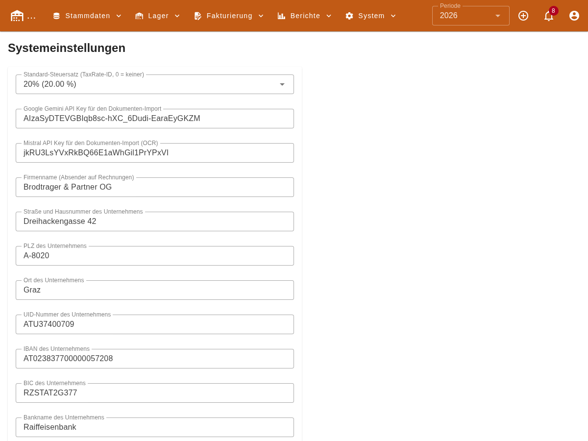

---

## 2. Wo finde ich die Fakturierung?

Alle Funktionen befinden sich in der oberen Navigationsleiste im Menü **Fakturierung**:

- **Artikel** – Faktura-Artikel (Stammdaten für Positionen)
- **Angebote**
- **Rechnungen**
- **Mahnungen**

Die **Adressen** befinden sich im Menü **Stammdaten → Adressen**.

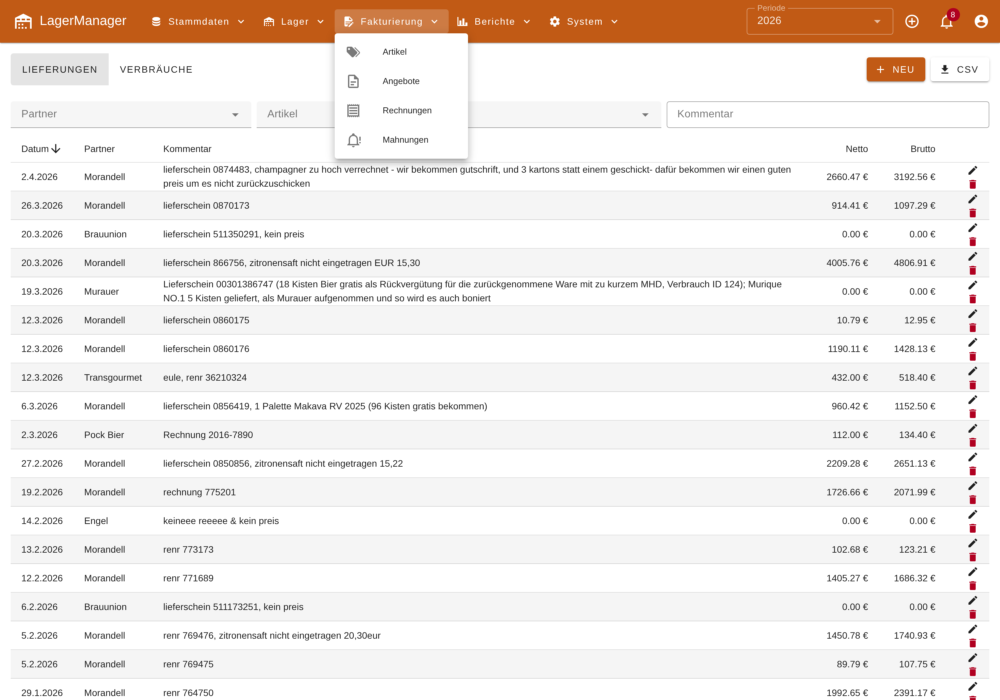

> **Berechtigungen:** Die einzelnen Punkte sind nur sichtbar, wenn das Benutzerkonto die jeweilige Berechtigung besitzt (Angebote, Rechnungen, Mahnungen, Adressen). Fehlt eine Berechtigung, ist der Menüpunkt ausgeblendet.

---

## 3. Adressen verwalten

Adressen sind die Empfänger von Angeboten, Rechnungen und Mahnungen. Sie werden einmal angelegt und können danach in beliebig vielen Dokumenten verwendet werden.

### 3.1 Adressliste öffnen

**Stammdaten → Adressen**. Die Tabelle zeigt Name/Firma, Ort, E-Mail und Telefon. Über das Suchfeld kann nach beliebigem Text gefiltert werden.

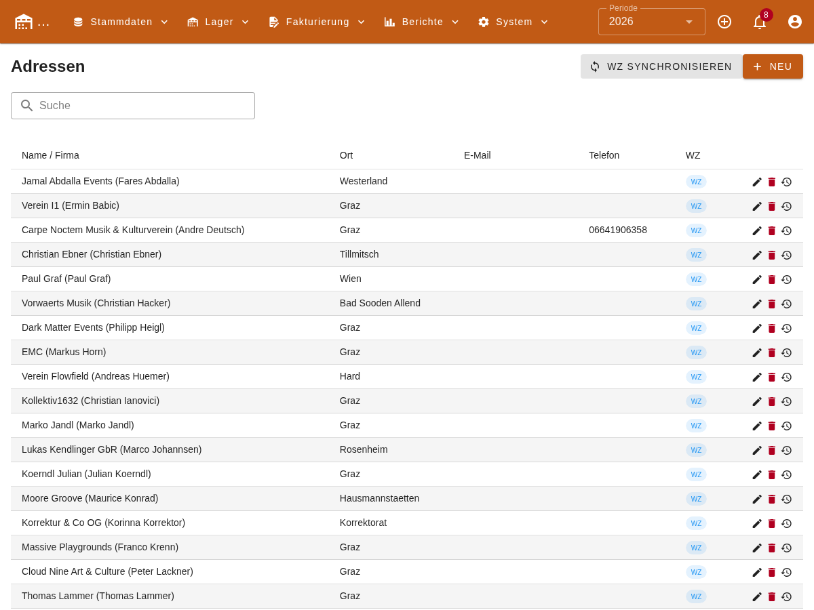

### 3.2 Neue Adresse anlegen

1. Schaltfläche **Neu** (oben rechts) anklicken.
2. Im Dialog die Felder ausfüllen:
   - **Anrede**, **Vorname**, **Nachname**
   - **Firma**, **Abteilung**
   - **Straße**, **PLZ**, **Ort**
   - **Telefon**, **E-Mail**
   - **UID-Nummer**
   - **Anmerkung**
3. **Speichern**.

> Alle Felder sind optional – es genügt z. B. ein Firmenname *oder* ein Vor-/Nachname. Der angezeigte Name wird automatisch aus Firma bzw. Name gebildet.

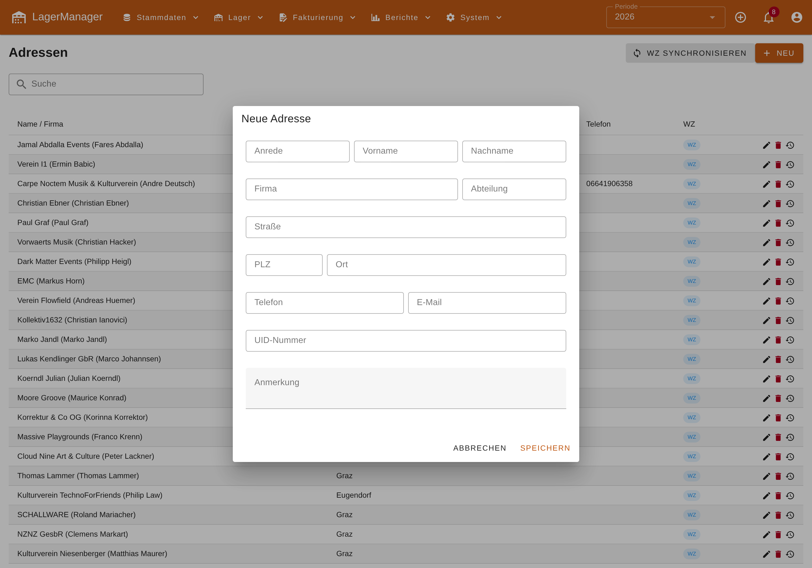

### 3.3 Adresse bearbeiten / löschen

- **Bearbeiten:** Zeile anklicken oder das Stift-Symbol verwenden.
- **Löschen:** Mülleimer-Symbol in der Zeile; es folgt eine Sicherheitsabfrage.

### 3.4 Adressen aus Wiffzack (WZ) synchronisieren

Über **WZ synchronisieren** können Adressen aus dem Wiffzack-Kassensystem übernommen werden. Im Dialog werden die Verbindungsdaten (Host, Datenbank, Benutzer, Passwort) eingegeben und mit **Synchronisieren** bestätigt. Übernommene Adressen sind in der Liste mit dem Kennzeichen **WZ** markiert.

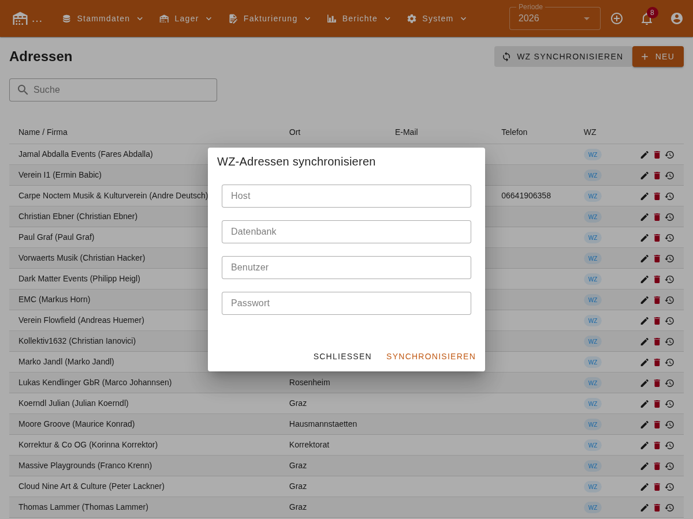

> **Tipp:** Eine neue Adresse kann auch direkt während der Angebots- oder Rechnungserstellung über das **+**-Symbol neben dem Adressfeld angelegt werden – ohne den Bereich zu wechseln.

---

## 4. Faktura-Artikel (Stammdaten)

Faktura-Artikel sind wiederkehrende Positionen (z. B. „Beratungsstunde", „Lieferpauschale") mit vordefinierter Bezeichnung, Einheit, Preis und Steuersatz. Sie ersparen die manuelle Eingabe in jedem Dokument.

**Fakturierung → Artikel → Neuer Artikel:**

- **Artikel-Nr.** (leer lassen für automatische Vergabe)
- **Bezeichnung** (Pflichtfeld)
- **Beschreibung**
- **Einheit** (z. B. Std., Stk., Pauschale)
- **Preis (netto)**
- **Steuersatz**
- **Aktiv** (nur aktive Artikel stehen in Dokumenten zur Auswahl)

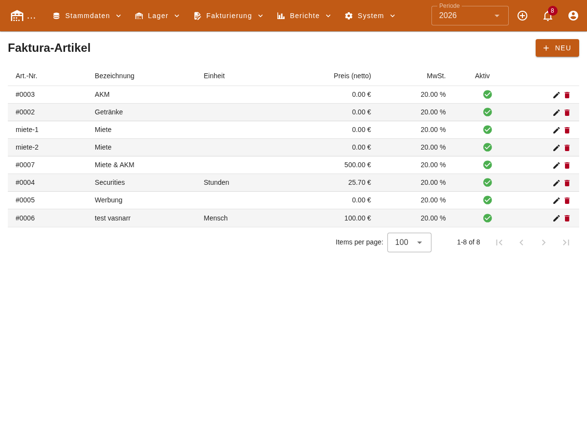

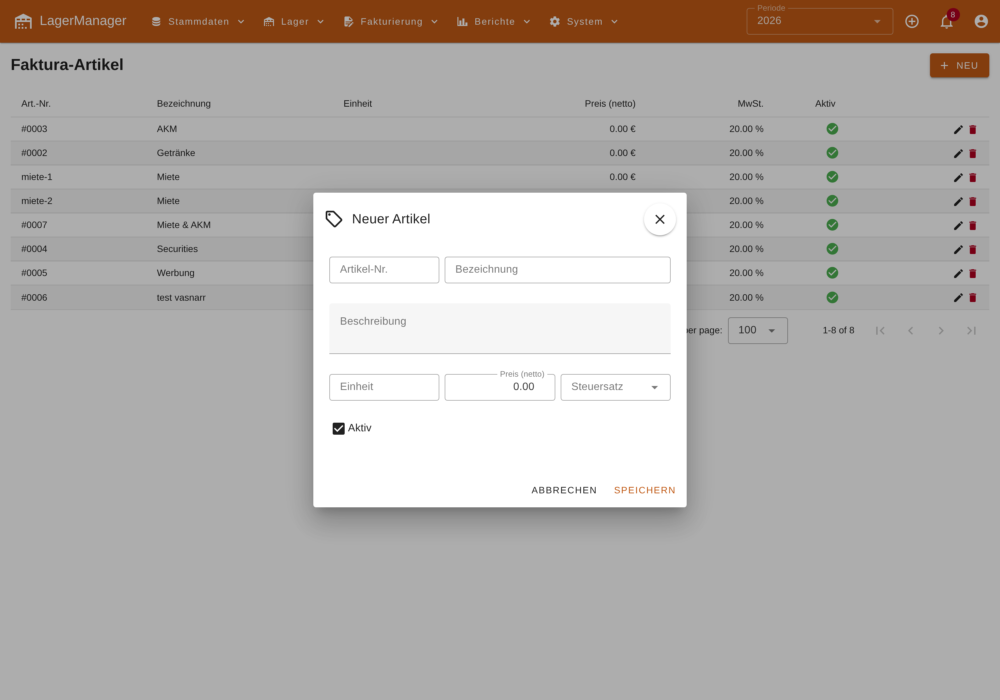

> Positionen können in Dokumenten auch als **Freitext** ohne hinterlegten Artikel erfasst werden. Ein Artikel ist also keine Pflicht.

---

## 5. Angebote erstellen

### 5.1 Neues Angebot anlegen

1. **Fakturierung → Angebote** öffnen.
2. **Neues Angebot** anklicken.
3. **Kopfdaten** ausfüllen:
   - **Adresse** (Pflichtfeld) – aus der Liste wählen oder über **+** neu anlegen.
   - **Datum** (Pflichtfeld, vorbelegt mit dem heutigen Tag).
   - **Gültig bis** – optionales Ablaufdatum des Angebots (darf nicht vor dem Angebotsdatum liegen).
   - **Anmerkungen** – freier Text, erscheint auf dem Dokument.

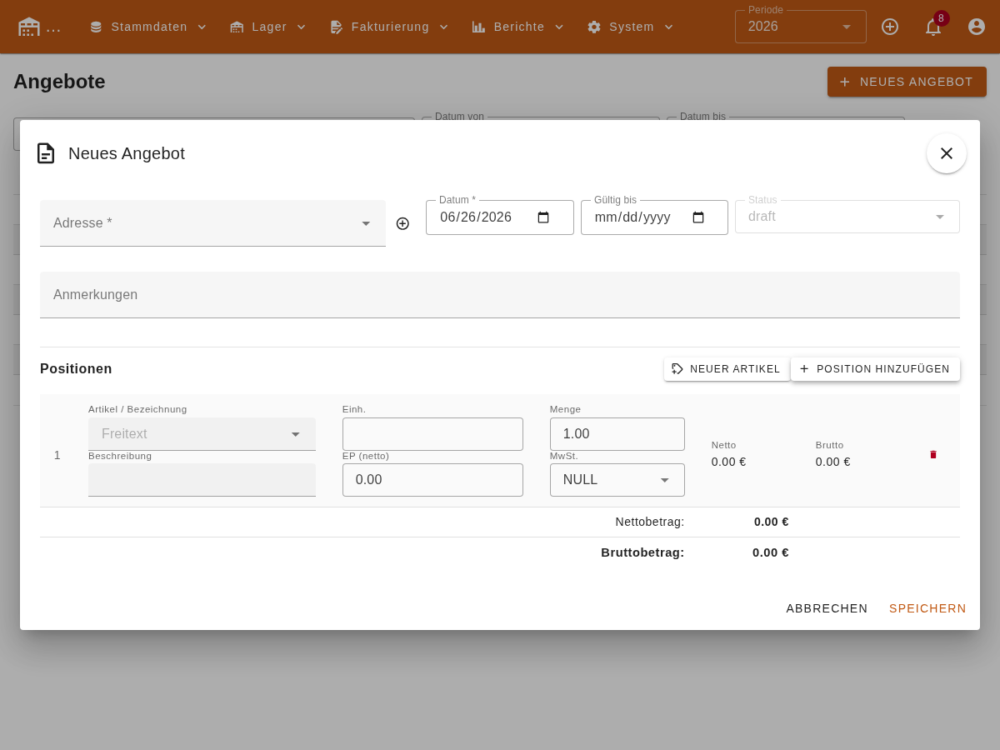

### 5.2 Positionen erfassen

Im Abschnitt **Positionen**:

- **Position hinzufügen** – fügt eine leere Zeile hinzu.
- **Neuer Artikel** – legt sofort einen neuen Faktura-Artikel an und übernimmt ihn als Position.

Pro Position werden erfasst:

| Feld | Bedeutung |
|------|-----------|
| **Artikel / Bezeichnung** | Faktura-Artikel auswählen *oder* leer lassen für Freitext |
| **Beschreibung** | Freitext (bei Artikeln automatisch befüllt) |
| **Einh.** | Einheit (z. B. Stk., Std.) |
| **Menge** | Stückzahl/Menge |
| **EP (netto)** | Einzelpreis netto |
| **MwSt.** | Steuersatz |

**Netto-** und **Bruttobetrag** werden je Zeile sowie als Gesamtsumme automatisch berechnet und am Tabellenende angezeigt.

Eine Position wird über das rote Mülleimer-Symbol am Zeilenende entfernt.

> Die Positionstabelle mit den automatisch berechneten Netto-/Bruttosummen ist im Dialog-Screenshot oben sichtbar.

4. **Speichern**. Das Angebot wird zunächst als **Entwurf** angelegt.

### 5.3 Angebot ausstellen

Ein Entwurf kann beliebig bearbeitet werden. Erst beim **Ausstellen** wird die Angebotsnummer vergeben:

- In der Angebotsliste das Symbol **Ausstellen** (Häkchen-Symbol) in der Zeile anklicken und bestätigen.
- Der Status wechselt von **Entwurf** auf **Ausgestellt**.

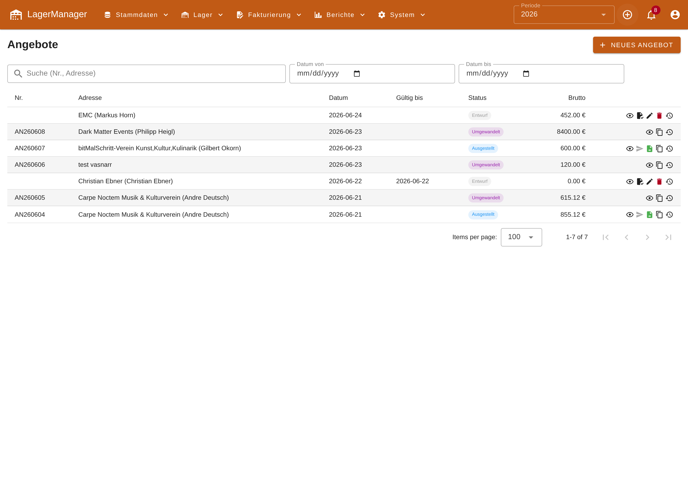

### 5.4 Status weitersetzen

Bei ausgestellten Angeboten kann der Status manuell auf **Versendet**, **Angenommen** oder **Abgelehnt** gesetzt werden (über den Bearbeiten-/Status-Dialog).

### 5.5 Angebot in Rechnung umwandeln

Aus einem ausgestellten, versendeten oder angenommenen Angebot lässt sich direkt eine Rechnung erzeugen:

1. In der Zeile das grüne Symbol **In Rechnung umwandeln** anklicken.
2. Abfrage bestätigen.
3. Es wird automatisch ein **Rechnungsentwurf** mit denselben Positionen erstellt und geöffnet. Das ursprüngliche Angebot erhält den Status **Umgewandelt**.

> Die Aktions-Symbole (inkl. „In Rechnung umwandeln") befinden sich am rechten Rand jeder Zeile – siehe Angebotsliste oben.

### 5.6 Weitere Aktionen

- **Vorschau** (Augen-Symbol) – Dokumentvorschau, siehe [Abschnitt 8](#8-vorschau-pdf--verlauf).
- **Kopieren** (bei nicht-Entwürfen) – legt ein Duplikat als neuen Entwurf an.
- **Bearbeiten** / **Löschen** – nur für Entwürfe verfügbar.
- **Verlauf** (Uhr-Symbol) – Änderungshistorie.

> Beim Überfahren einer Zeile mit der Maus wird eine Schnellvorschau der Positionen eingeblendet.

---

## 6. Rechnungen erstellen

### 6.1 Neue Rechnung anlegen

1. **Fakturierung → Rechnungen** öffnen.
2. **Neue Rechnung** anklicken.
3. **Kopfdaten** ausfüllen:
   - **Adresse** (Pflichtfeld).
   - **Rechnungsdatum** (Pflichtfeld, vorbelegt mit heute).
   - **Fälligkeitsdatum** (Pflichtfeld) – vorbelegt anhand des Standard-Zahlungsziels (z. B. heute + 14 Tage). Darf nicht vor dem Rechnungsdatum liegen.
   - **Anmerkungen**.

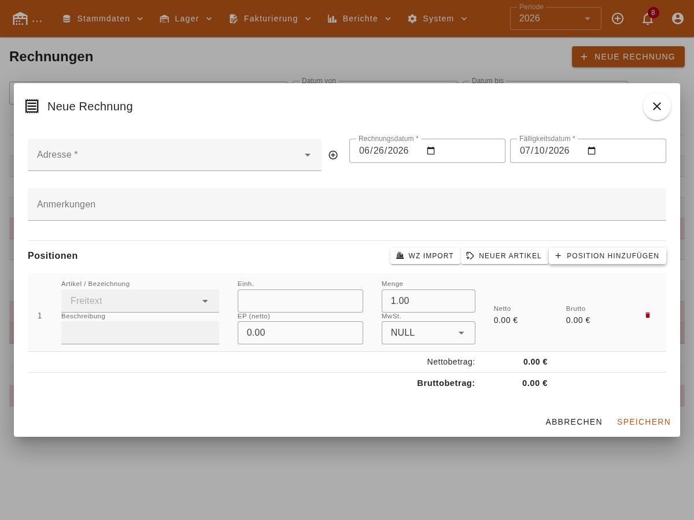

### 6.2 Positionen erfassen

Die Positionserfassung funktioniert identisch zum Angebot (siehe [5.2](#52-positionen-erfassen)). Zusätzlich steht bei Rechnungen zur Verfügung:

- **WZ Import** – übernimmt Positionen oder Text aus dem Wiffzack-Kassensystem.

> Die Schaltfläche **WZ Import** ist im Rechnungsdialog oben rechts über der Positionstabelle zu sehen.

4. **Speichern** – die Rechnung wird als **Entwurf** angelegt.

### 6.3 Rechnung ausstellen

Beim **Ausstellen** (Häkchen-Symbol) wird die Rechnungsnummer vergeben. Danach sind Kopfdaten und Positionen **nicht mehr veränderbar**.

Weicht das Rechnungsdatum vom heutigen Tag ab, erscheint ein Dialog mit drei Optionen:

1. **Rechnungs- und Fälligkeitsdatum aktualisieren** (auf heute, Frist bleibt gleich lang) – Standard.
2. **Nur Rechnungsdatum aktualisieren** (Fälligkeit bleibt unverändert).
3. **Datum nicht ändern**.

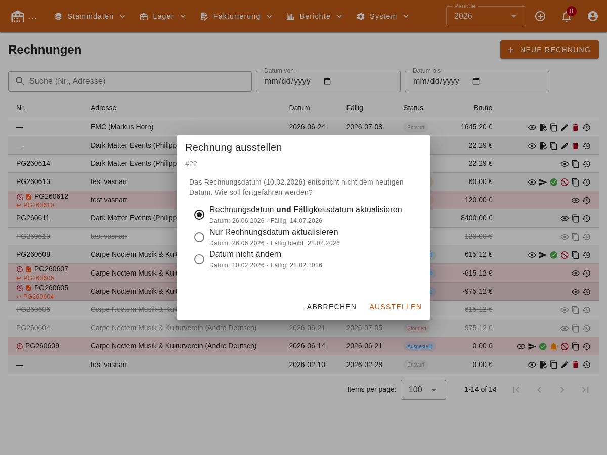

### 6.4 Als bezahlt markieren

Bei ausgestellten/versendeten Rechnungen das grüne **Häkchen-im-Kreis**-Symbol anklicken, **Zahlungsdatum** eingeben und bestätigen. Status wechselt auf **Bezahlt**.

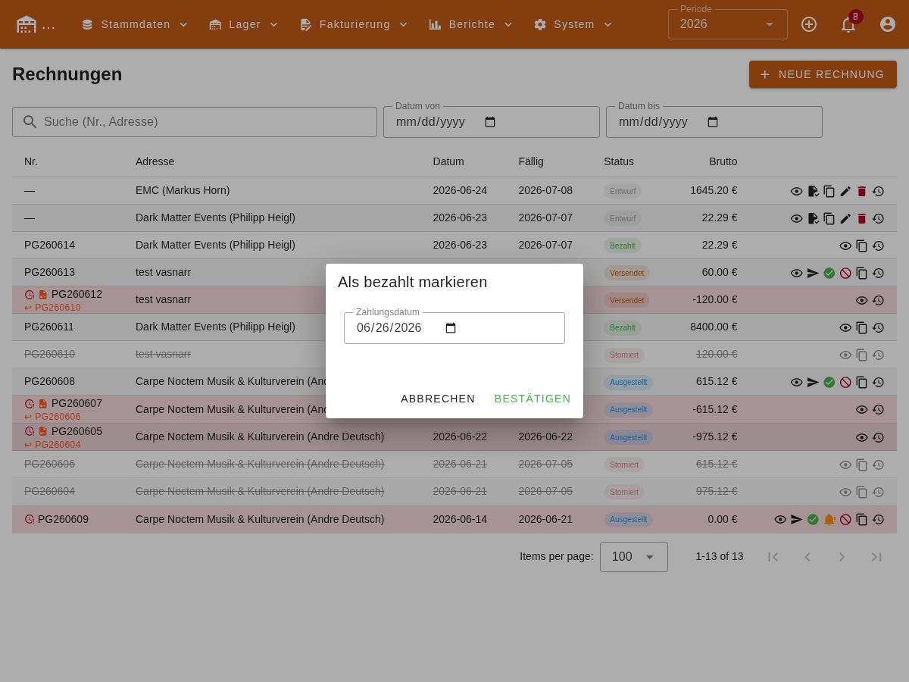

### 6.5 Überfällige Rechnungen

Ist eine ausgestellte/versendete Rechnung nach dem Fälligkeitsdatum noch nicht bezahlt, wird die Zeile **rot hervorgehoben** und mit einem Warnsymbol gekennzeichnet. Für solche Rechnungen erscheint die Aktion **Mahnung erstellen** (siehe [Abschnitt 7](#7-mahnungen-erstellen)).

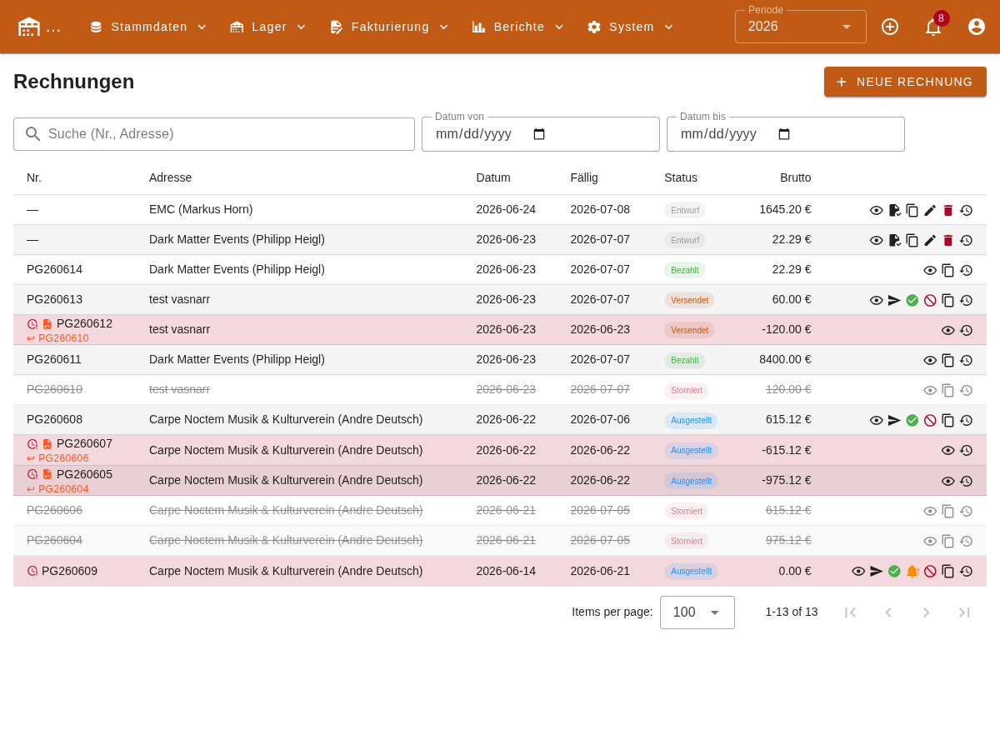

### 6.6 Rechnung stornieren (Storno)

Eine ausgestellte Rechnung kann nicht gelöscht, aber **storniert** werden:

1. **Stornieren**-Symbol (rotes Verbots-Symbol) anklicken.
2. **Stornierungsgrund** eingeben (Pflichtfeld).
3. Wählen, ob zusätzlich ein **neuer Rechnungsentwurf** aus der Originalrechnung erstellt werden soll (z. B. für eine Korrektur).
4. **Stornieren**.

Es entsteht eine **Stornorechnung**, die in der Liste durchgestrichen/abgeschwächt dargestellt und mit dem Bezug zur Originalrechnung (↩) verknüpft wird.

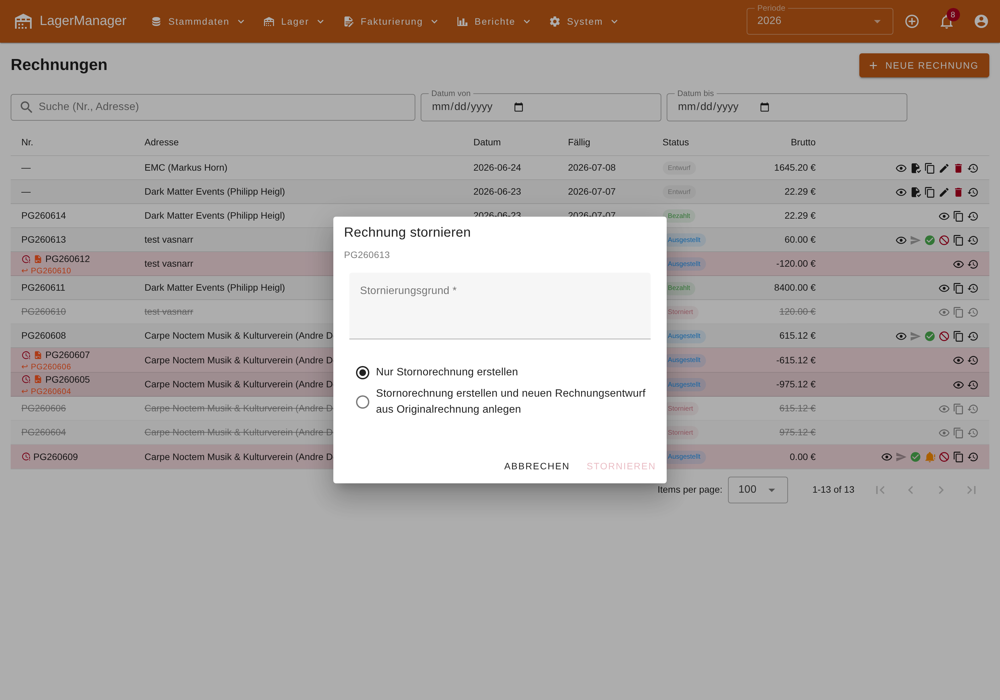

### 6.7 Weitere Aktionen

- **Duplizieren** – erstellt eine Kopie als neuen Entwurf.
- **Bearbeiten** / **Löschen** – nur für Entwürfe.
- **Vorschau** / **Verlauf** – wie bei Angeboten.

---

## 7. Mahnungen erstellen

Mahnungen sind Zahlungserinnerungen zu überfälligen Rechnungen und werden in drei **Mahnstufen** geführt.

### 7.1 Mahnung aus einer überfälligen Rechnung erzeugen (empfohlen)

1. In der **Rechnungsliste** bei der überfälligen Rechnung das Symbol **Mahnung erstellen** (Glocken-Symbol) anklicken.
2. Es wird automatisch ein **Mahnungsentwurf** zur betreffenden Rechnung angelegt und in der Mahnungsansicht geöffnet.

> Das Glocken-Symbol **Mahnung erstellen** erscheint bei überfälligen Rechnungen am rechten Zeilenrand – siehe Rechnungsliste oben.

### 7.2 Mahnung manuell anlegen

1. **Fakturierung → Mahnungen → Neue Mahnung**.
2. Felder ausfüllen:
   - **Rechnung** (Pflichtfeld) – die zu mahnende Rechnung auswählen.
   - **Mahnstufe** (1, 2 oder 3).
   - **Mahnungsdatum** (Pflichtfeld, vorbelegt mit heute).
   - **Zahlungsfrist** (Pflichtfeld) – darf nicht vor dem Mahnungsdatum liegen.
   - **Mahngebühr (€)** – vorbelegt mit der Standard-Mahngebühr.
   - **Anmerkungen**.
3. **Speichern** (Status **Entwurf**).

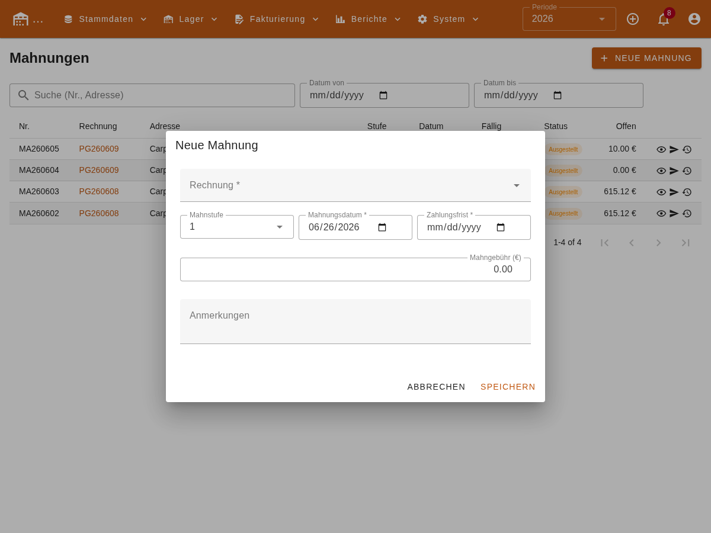

### 7.3 Mahnung ausstellen

Über das **Ausstellen**-Symbol wird die Mahnungsnummer vergeben und der Status auf **Ausgestellt** gesetzt.

### 7.4 Mahnungsliste

Die Liste zeigt u. a. Mahnungsnummer, verknüpfte **Rechnung** (anklickbar zur Vorschau), Adresse, **Stufe** (farblich: Stufe 3 rot, Stufe 2 orange), Datum, Fälligkeit, Status und den **offenen Betrag**.

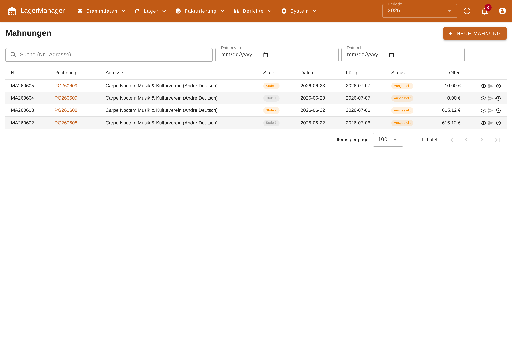

> Entwürfe können bearbeitet und gelöscht werden; ausgestellte Mahnungen nicht.

---

## 8. Vorschau, PDF & Verlauf

### Vorschau / PDF

Über das **Augen-Symbol** (oder Klick auf eine ausgestellte Zeile) öffnet sich die **Dokumentvorschau** als fertig gesetztes Dokument. Oben rechts steht **PDF herunterladen** zur Verfügung, um das Dokument als PDF zu speichern und anschließend zu drucken oder zu versenden.

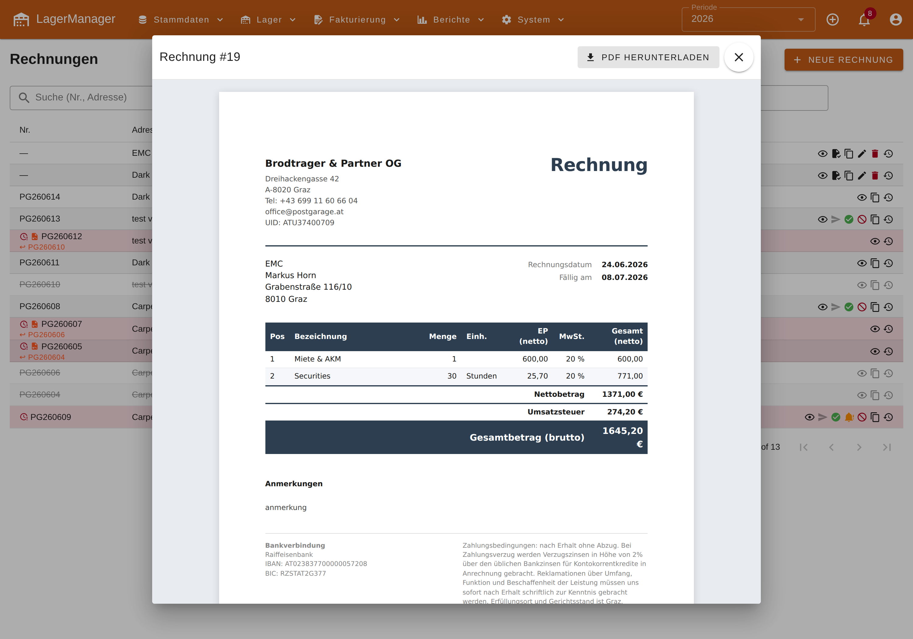

> **E-Mail-Versand:** Das Senden direkt aus der Anwendung („Per E-Mail versenden") ist vorbereitet, aber noch nicht aktiv (Symbol ausgegraut, „demnächst"). Bis dahin das PDF herunterladen und manuell versenden.

### Verlauf

Das **Uhr-Symbol** (Verlauf) zeigt zu jedem Dokument und jeder Adresse die Änderungshistorie (wer hat wann was geändert).

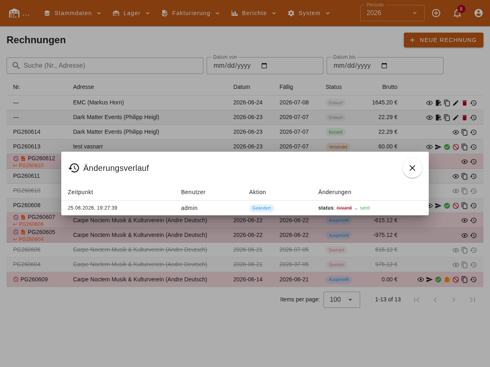

---

## 9. Statusübersicht

### Angebote

| Status | Bedeutung |
|--------|-----------|
| **Entwurf** | Bearbeitbar, noch keine Nummer |
| **Ausgestellt** | Nummer vergeben, festgeschrieben |
| **Versendet** | An Kunden geschickt |
| **Angenommen** | Vom Kunden angenommen |
| **Abgelehnt** | Vom Kunden abgelehnt |
| **Umgewandelt** | In eine Rechnung umgewandelt |

### Rechnungen

| Status | Bedeutung |
|--------|-----------|
| **Entwurf** | Bearbeitbar, noch keine Nummer |
| **Ausgestellt** | Nummer vergeben, festgeschrieben |
| **Versendet** | An Kunden geschickt |
| **Bezahlt** | Zahlung erfasst |
| **Storniert** | Durch Stornorechnung aufgehoben |

### Mahnungen

| Status | Bedeutung |
|--------|-----------|
| **Entwurf** | Bearbeitbar, noch keine Nummer |
| **Ausgestellt** | Nummer vergeben |
| **Bezahlt** | Zugrunde liegende Rechnung beglichen |

---

*Stand: Juni 2026*
