# Benutzerhandbuch – Fakturierung

Anleitung zum Erstellen von **Angeboten**, **Rechnungen** und **Mahnungen** sowie zur Verwaltung von **Adressen** im LagerManager.

> **Hinweis zu Screenshots:** Alle Abbildungen in diesem Handbuch liegen als Bilddateien unter `docs/img/fakturierung/`.

---

## Inhaltsverzeichnis

1. [Überblick & Voraussetzungen](#1-überblick--voraussetzungen)
    - [Einmalige Voraussetzungen (Einstellungen)](#einmalige-voraussetzungen-einstellungen)
2. [Wo finde ich die Fakturierung?](#2-wo-finde-ich-die-fakturierung)
3. [Adressen verwalten](#3-adressen-verwalten)
    - [3.1 Adressliste öffnen](#31-adressliste-öffnen)
    - [3.2 Neue Adresse anlegen](#32-neue-adresse-anlegen)
    - [3.3 Adresse bearbeiten / löschen](#33-adresse-bearbeiten--löschen)
    - [3.4 Adressen aus Wiffzack (WZ) synchronisieren](#34-adressen-aus-wiffzack-wz-synchronisieren)
4. [Faktura-Artikel](#4-faktura-artikel)
5. [Angebote erstellen](#5-angebote-erstellen)
    - [5.1 Neues Angebot anlegen](#51-neues-angebot-anlegen)
    - [5.2 Positionen erfassen](#52-positionen-erfassen)
    - [5.3 Angebot ausstellen](#53-angebot-ausstellen)
    - [5.4 Status weitersetzen](#54-status-weitersetzen)
    - [5.5 Angebot in Rechnung umwandeln](#55-angebot-in-rechnung-umwandeln)
    - [5.6 Weitere Aktionen](#56-weitere-aktionen)
6. [Rechnungen erstellen](#6-rechnungen-erstellen)
    - [6.1 Neue Rechnung anlegen](#61-neue-rechnung-anlegen)
    - [6.2 Positionen erfassen](#62-positionen-erfassen)
    - [6.3 Rechnung ausstellen](#63-rechnung-ausstellen)
    - [6.4 Als bezahlt markieren](#64-als-bezahlt-markieren)
    - [6.5 Überfällige Rechnungen](#65-überfällige-rechnungen)
    - [6.6 Rechnung stornieren (Storno)](#66-rechnung-stornieren-storno)
    - [6.7 Weitere Aktionen](#67-weitere-aktionen)
    - [6.8 Rechnungsvorlagen](#68-rechnungsvorlagen)
7. [Mahnungen erstellen](#7-mahnungen-erstellen)
    - [7.1 Mahnung aus einer überfälligen Rechnung erzeugen (empfohlen)](#71-mahnung-aus-einer-überfälligen-rechnung-erzeugen-empfohlen)
    - [7.2 Mahnung manuell anlegen](#72-mahnung-manuell-anlegen)
    - [7.3 Mahnung ausstellen](#73-mahnung-ausstellen)
    - [7.4 Mahnungsliste](#74-mahnungsliste)
8. [Vorschau, PDF, Versand & Verlauf](#8-vorschau-pdf-versand--verlauf)
    - [Vorschau / PDF](#vorschau--pdf)
    - [E-Mail-Versand](#e-mail-versand)
    - [Verlauf](#verlauf)
9. [Statusübersicht](#9-statusübersicht)
    - [Angebote](#angebote)
    - [Rechnungen](#rechnungen)
    - [Mahnungen](#mahnungen)
10. [Anhang: Änderungsprotokoll](#anhang-änderungsprotokoll)

---

## 1. Überblick & Voraussetzungen

Die Fakturierung ist Teil des Lager Managers V2 und unter [https://172.16.73.1/invoices](https://172.16.73.1/invoices) erreichbar (Voraussetzung: aktives VPN).

Die Fakturierung umfasst vier zusammenhängende Bereiche:

| Bereich | Zweck |
|---------|-------|
| **Adressen** | Empfänger (Kunden, Firmen) für Dokumente |
| **Angebote** | Unverbindliche Kostenvoranschläge, können in Rechnungen umgewandelt werden |
| **Rechnungen** | Verbindliche Zahlungsaufforderungen |
| **Mahnungen** | Zahlungserinnerungen zu überfälligen Rechnungen |

**Typischer Ablauf:**

```
Adresse anlegen  →  Angebot  →  (Umwandeln)  →  Rechnung
→  (bei Überfälligkeit)  →  Mahnung
```

**Ein Angebot ist nicht zwingend – eine Rechnung kann auch direkt erstellt werden.**

### Einmalige Voraussetzungen (Einstellungen)

Damit die erzeugten Dokumente korrekt aussehen, sollten unter **Verwaltung → Einstellungen** einmalig die Firmendaten hinterlegt werden. Diese erscheinen als Absender bzw. in der Fußzeile der PDF-Dokumente:

- **Firmenlogo** – Bilddatei (PNG, JPEG, GIF, WebP oder SVG), die oben im PDF erscheint. Über **Logo hochladen** auswählen; mit **Logo entfernen** wieder löschen. Eine Vorschau wird direkt angezeigt.
- **Firmenname**, **Straße**, **PLZ**, **Ort**
- **UID-Nummer**, **E-Mail**, **Telefon**
- **IBAN**, **BIC**, **Bankname** (für die Zahlungsinformationen)
- **Fußzeilen-Text** für Rechnungen/Angebote
- **Standard-Zahlungsziel in Tagen** (Vorgabe: 14) – bestimmt das beim Ausstellen einer Rechnung vorgeschlagene Fälligkeitsdatum
- **Standard-Mahngebühr** in Euro
- **Maximale Mahnstufe** (Vorgabe: 3) – ist die höchste Mahnstufe erreicht, erscheint auf der Mahnung „Letzte Mahnung" statt der Stufennummer
- **Nummernpräfixe** für Angebote (Vorgabe `AN`), Rechnungen (`RE`) und Mahnungen (`MA`)
- **E-Mail-Betreff** und **E-Mail-Text** je Dokumentart (Angebot, Rechnung, Mahnung) für den [E-Mail-Versand](#8-vorschau-pdf-versand--verlauf). In den Vorlagen werden die Platzhalter `{number}` (Dokumentnummer), `{company}` (Firmenname) und `{recipient_name}` (Empfänger) beim Versand automatisch ersetzt.

> Die Dokumentnummern werden automatisch im Format `PRÄFIXJJMM##` vergeben (z. B. `RE260601` für die erste Rechnung im Juni 2026). Die Nummer wird erst beim **Ausstellen** vergeben.

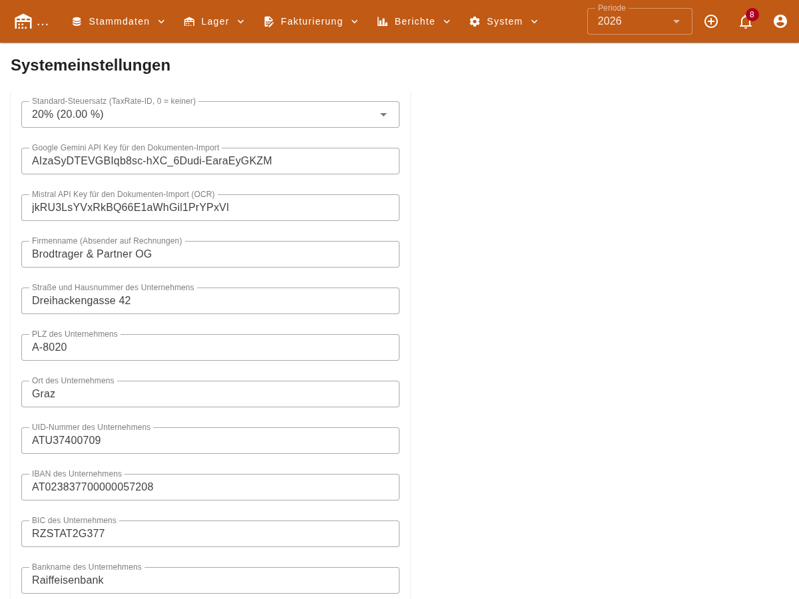

Die E-Mail-Vorlagen befinden sich weiter unten auf derselben Seite:

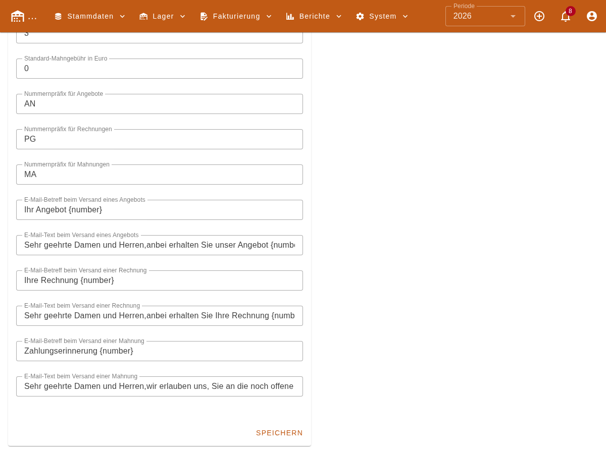

> Der **Absender**, die **SMTP-Zugangsdaten** sowie eine optionale **Reply-To-Adresse** (`DEFAULT_REPLY_TO_EMAIL`) für den tatsächlichen Mailversand werden serverseitig (Umgebungs-/Serverkonfiguration) hinterlegt. Ist `DEFAULT_REPLY_TO_EMAIL` gesetzt, wird diese Adresse als Reply-To-Header aller ausgehenden Dokument-E-Mails verwendet.

---

## 2. Wo finde ich die Fakturierung?

Alle Funktionen befinden sich in der oberen Navigationsleiste im Menü **Fakturierung**:

- **Artikel** – Faktura-Artikel (Stammdaten für Positionen)
- **Angebote**
- **Rechnungen**
- **Mahnungen**

Die **Adressen** befinden sich im Menü **Stammdaten → Adressen**.

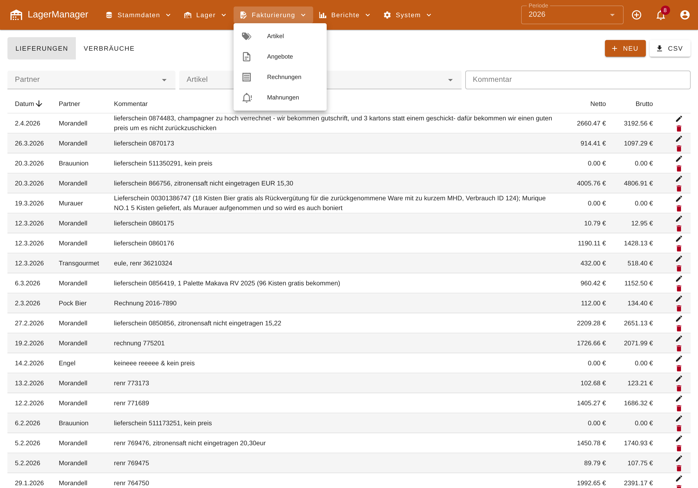

> **Berechtigungen:** Die einzelnen Punkte sind nur sichtbar, wenn das Benutzerkonto die jeweilige Berechtigung besitzt (Angebote, Rechnungen, Mahnungen, Adressen). Fehlt eine Berechtigung, ist der Menüpunkt ausgeblendet.

---

## 3. Adressen verwalten

Adressen sind die Empfänger von Angeboten, Rechnungen und Mahnungen. Sie werden einmal angelegt und können danach in beliebig vielen Dokumenten verwendet werden.

### 3.1 Adressliste öffnen

**Stammdaten → Adressen**. Die Tabelle zeigt Name/Firma, Ort, E-Mail und Telefon. Über das Suchfeld kann nach beliebigem Text gefiltert werden.

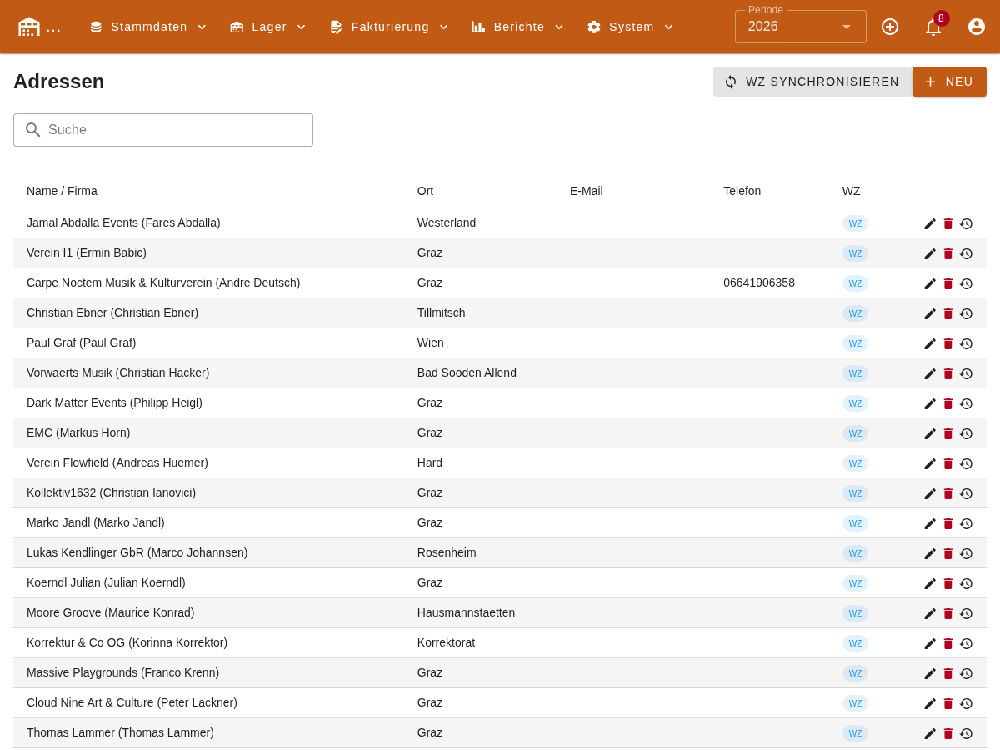

### 3.2 Neue Adresse anlegen

1. Schaltfläche **Neu** (oben rechts) anklicken.
2. Im Dialog die Felder ausfüllen:
   - **Anrede**, **Vorname**, **Nachname**
   - **Firma**, **Abteilung**
   - **Straße**, **PLZ**, **Ort**
   - **Telefon**, **E-Mail**
   - **UID-Nummer**
   - **Anmerkung**
3. **Speichern**.

> Alle Felder sind optional – es genügt z. B. ein Firmenname *oder* ein Vor-/Nachname. Der angezeigte Name wird automatisch aus Firma bzw. Name gebildet.

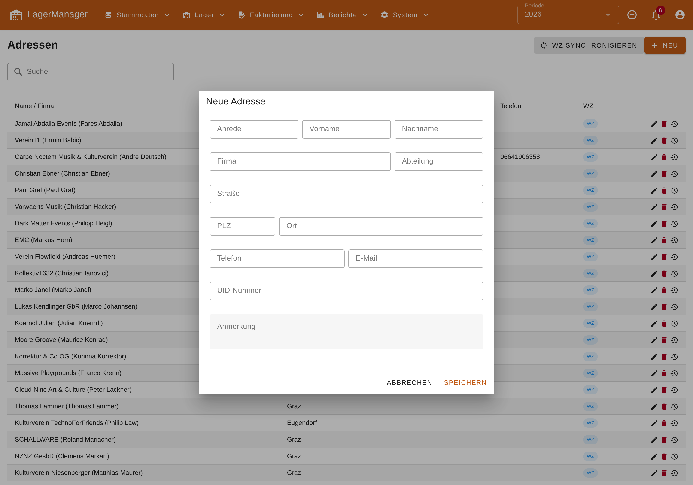

### 3.3 Adresse bearbeiten / löschen

- **Bearbeiten:** Zeile anklicken oder das Stift-Symbol verwenden.
- **Löschen:** Mülleimer-Symbol in der Zeile; es folgt eine Sicherheitsabfrage.

### 3.4 Adressen aus Wiffzack (WZ) synchronisieren

Über **WZ synchronisieren** können Adressen aus dem Wiffzack-Kassensystem übernommen werden. Im Dialog werden die Verbindungsdaten (Host, Datenbank, Benutzer, Passwort) eingegeben und mit **Synchronisieren** bestätigt. Übernommene Adressen sind in der Liste mit dem Kennzeichen **WZ** markiert.

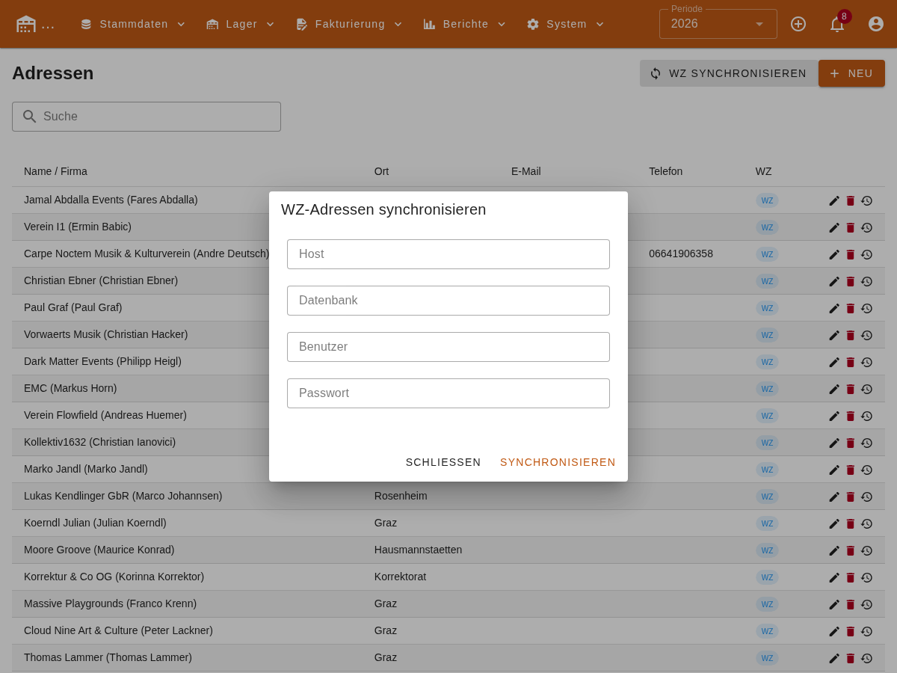

> **Tipp:** Eine neue Adresse kann auch direkt während der Angebots- oder Rechnungserstellung über das **+**-Symbol neben dem Adressfeld angelegt werden – ohne den Bereich zu wechseln.

---

## 4. Faktura-Artikel

Faktura-Artikel sind wiederkehrende Positionen (z. B. "Miete", „AKM") mit vordefinierter Bezeichnung, Einheit, Preis und Steuersatz. Sie ersparen die manuelle Eingabe in jedem Dokument.

**Fakturierung → Artikel → Neuer Artikel:**

- **Artikel-Nr.** (leer lassen für automatische Vergabe)
- **Bezeichnung** (Pflichtfeld)
- **Beschreibung**
- **Einheit** (z. B. Std., Stk., Pauschale)
- **Preis (netto)**
- **Steuersatz**
- **Aktiv** (nur aktive Artikel stehen in Dokumenten zur Auswahl)

Die Artikelliste zeigt die **Beschreibung** als eigene Spalte an (gekürzt mit Tooltip für längere Texte).

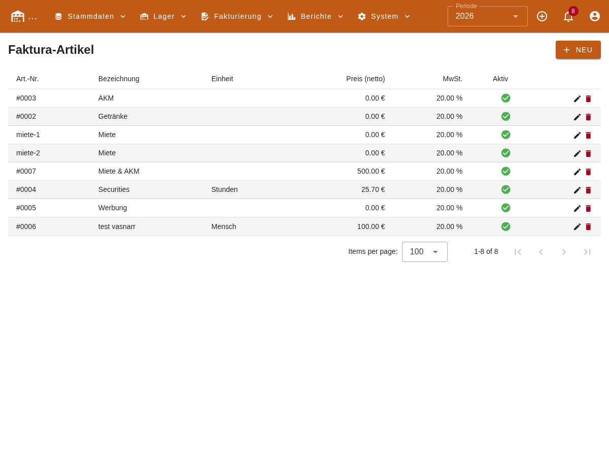

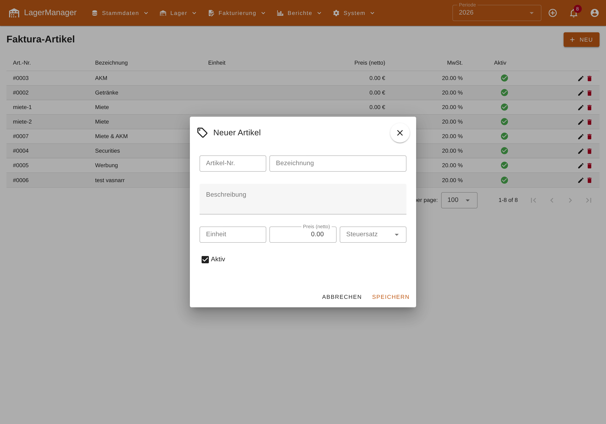

> Positionen können in Dokumenten auch als **Freitext** ohne hinterlegten Artikel erfasst werden. Ein Artikel ist also keine Pflicht.

---

## 5. Angebote erstellen

### 5.1 Neues Angebot anlegen

1. **Fakturierung → Angebote** öffnen.
2. **Neues Angebot** anklicken.
3. **Kopfdaten** ausfüllen:
   - **Adresse** (Pflichtfeld) – aus der Liste wählen oder über **+** neu anlegen.
   - **Datum** (Pflichtfeld, vorbelegt mit dem heutigen Tag).
   - **Gültig bis** – optionales Ablaufdatum des Angebots (darf nicht vor dem Angebotsdatum liegen).
   - **Anmerkungen** – freier Text, erscheint auf dem Dokument.

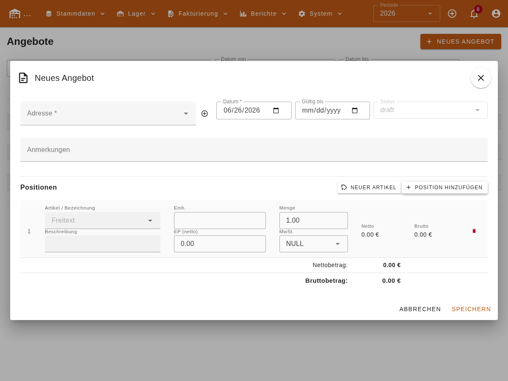

### 5.2 Positionen erfassen

Im Abschnitt **Positionen**:

- **Position hinzufügen** – fügt eine leere Zeile hinzu.
- **Neuer Artikel** – legt sofort einen neuen Faktura-Artikel an und übernimmt ihn als Position.

Pro Position werden erfasst:

| Feld | Bedeutung |
|------|-----------|
| **Artikel / Bezeichnung** | Faktura-Artikel auswählen *oder* leer lassen für Freitext. Artikel mit Beschreibung werden im Dropdown als „Name – Beschreibung" angezeigt (Beschreibung auf 50 Zeichen gekürzt). |
| **Beschreibung** | Freitext (bei Artikeln automatisch befüllt) |
| **Einh.** | Einheit (z. B. Stk., Std.) |
| **Menge** | Stückzahl/Menge |
| **EP (netto)** | Einzelpreis netto |
| **MwSt.** | Steuersatz |

**Netto-** und **Bruttobetrag** werden je Zeile sowie als Gesamtsumme automatisch berechnet und am Tabellenende angezeigt.

Eine Position wird über das rote Mülleimer-Symbol am Zeilenende entfernt.

> Die Positionstabelle mit den automatisch berechneten Netto-/Bruttosummen ist im Dialog-Screenshot oben sichtbar.

> **Positionen umsortieren:** Solange das Dokument bearbeitbar ist, kann die Reihenfolge der Positionen per **Drag-and-Drop** an der Positionsnummer oder über die kleinen **Pfeil-hoch/-runter-Symbole** daneben geändert werden. Die Reihenfolge bestimmt die Position („Pos"-Spalte) auf dem gedruckten Dokument.

> **Tipp – Formeln in Zahlenfeldern:** In Zahlenfeldern wie **Menge** oder **EP (netto)** kann statt eines Werts auch eine einfache Rechenformel eingegeben werden, beginnend mit `=` (z. B. `=12*3,5` oder `=(2+3)*4`). Nach Bestätigen mit Enter oder Verlassen des Felds wird das Ergebnis berechnet und eingesetzt. Ist die Formel ungültig, wird `NaN` angezeigt und das Speichern verhindert; beim erneuten Anklicken des Felds erscheint die ursprüngliche Formel wieder zur Korrektur.

4. **Speichern**. Das Angebot wird zunächst als **Entwurf** angelegt.

### 5.3 Angebot ausstellen

Ein Entwurf kann beliebig bearbeitet werden. Erst beim **Ausstellen** wird die Angebotsnummer vergeben:

- In der Angebotsliste das Symbol **Ausstellen** (Dokument-mit-Häkchen-Symbol) in der Zeile anklicken und bestätigen.
- Der Status wechselt von **Entwurf** auf **Ausgestellt**.

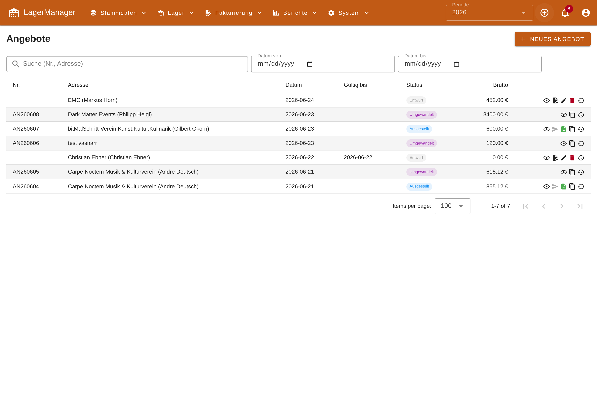

### 5.4 Status weitersetzen

Bei ausgestellten Angeboten kann der Status manuell auf **Versendet**, **Angenommen** oder **Abgelehnt** gesetzt werden (über den Bearbeiten-/Status-Dialog). Beim [E-Mail-Versand](#8-vorschau-pdf-versand--verlauf) wird der Status **Versendet** automatisch gesetzt.

### 5.5 Angebot in Rechnung umwandeln

Aus einem ausgestellten, versendeten oder angenommenen Angebot lässt sich direkt eine Rechnung erzeugen:

1. In der Zeile das grüne Symbol **In Rechnung umwandeln** anklicken.
2. Abfrage bestätigen.
3. Es wird automatisch ein **Rechnungsentwurf** mit denselben Positionen erstellt und geöffnet. Das ursprüngliche Angebot erhält den Status **Umgewandelt**.

> Die Aktions-Symbole (inkl. „In Rechnung umwandeln") befinden sich am rechten Rand jeder Zeile – siehe Angebotsliste oben.

### 5.6 Weitere Aktionen

- **Vorschau** (Augen-Symbol) – Dokumentvorschau, siehe [Abschnitt 8](#8-vorschau-pdf-versand--verlauf).
- **Senden** (Papierflieger-Symbol) – Angebot per E-Mail versenden, siehe [Abschnitt 8](#8-vorschau-pdf-versand--verlauf).
- **Kopieren** (bei nicht-Entwürfen) – legt ein Duplikat als neuen Entwurf an.
- **Bearbeiten** / **Löschen** – nur für Entwürfe verfügbar.
- **Verlauf** (Uhr-Symbol) – Änderungshistorie.

> Beim Überfahren einer Zeile mit der Maus wird eine Schnellvorschau der Positionen eingeblendet.

---

## 6. Rechnungen erstellen

### 6.1 Neue Rechnung anlegen

1. **Fakturierung → Rechnungen** öffnen.
2. **Neue Rechnung** anklicken.
3. **Kopfdaten** ausfüllen:
   - **Adresse** (Pflichtfeld).
   - **Leistungsdatum** (optional) – Datum, an dem die Leistung tatsächlich erbracht wurde. Bleibt es leer, gilt auf dem Dokument das Rechnungsdatum als Leistungsdatum.
   - **Anmerkungen**.

> Ein **Rechnungsdatum** wird im Entwurf nicht mehr manuell erfasst: Es wird zusammen mit dem Fälligkeitsdatum erst beim [Ausstellen](#63-rechnung-ausstellen) automatisch gesetzt.

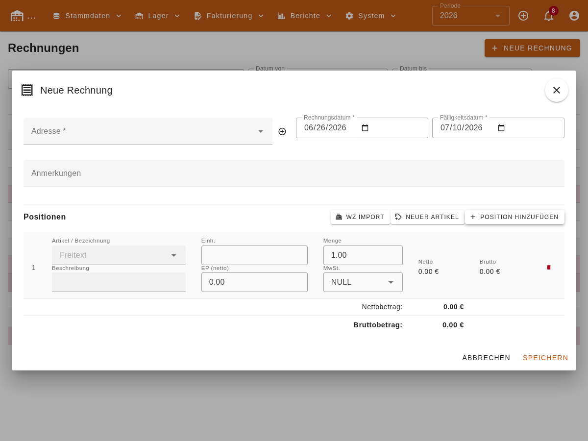

### 6.2 Positionen erfassen

Die Positionserfassung funktioniert identisch zum Angebot (siehe [5.2](#52-positionen-erfassen)). Zusätzlich steht bei Rechnungen zur Verfügung:

- **WZ Import** – übernimmt Positionen oder Text aus dem Wiffzack-Kassensystem.

> Die Schaltfläche **WZ Import** ist im Rechnungsdialog oben rechts über der Positionstabelle zu sehen.

4. **Speichern** – die Rechnung wird als **Entwurf** angelegt.

### 6.3 Rechnung ausstellen

Beim **Ausstellen** (Dokument-mit-Häkchen-Symbol) wird die Rechnungsnummer vergeben. Danach sind Kopfdaten und Positionen **nicht mehr veränderbar**.

Das **Rechnungsdatum** wird dabei automatisch auf das heutige Datum gesetzt. Im Dialog muss nur noch das **Fälligkeitsdatum** bestätigt bzw. angepasst werden – vorbelegt anhand des Standard-Zahlungsziels (heute + konfigurierte Anzahl Tage, siehe [Einstellungen](#1-überblick--voraussetzungen)). Es darf nicht vor dem heutigen Tag liegen.

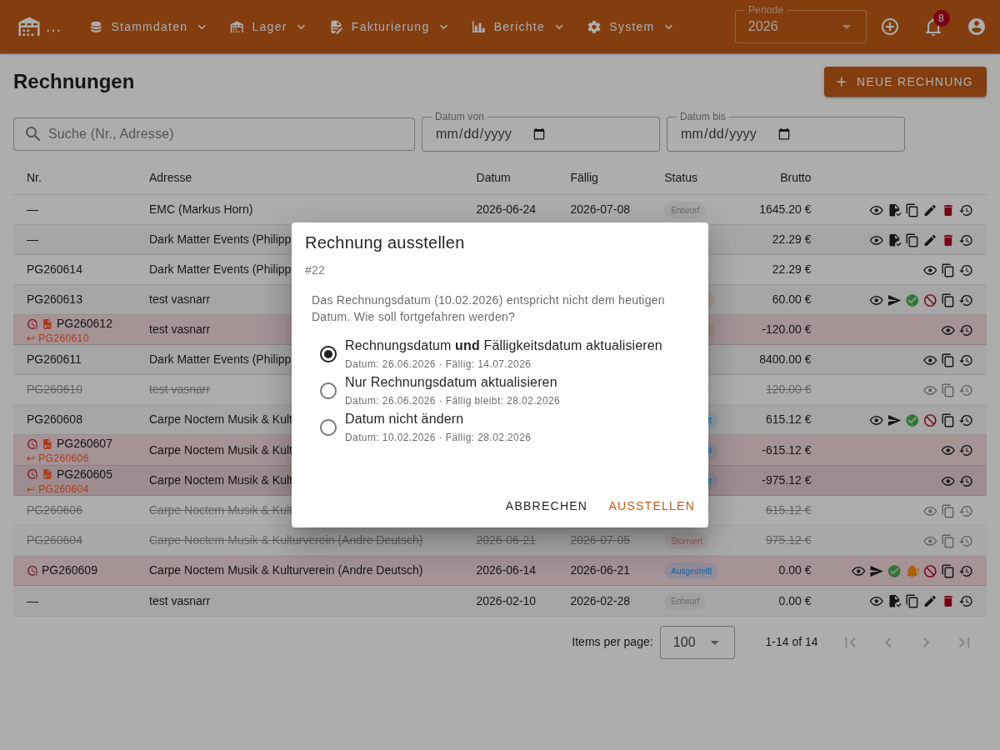

### 6.4 Als bezahlt markieren

Bei ausgestellten/versendeten Rechnungen das grüne **Häkchen-im-Kreis**-Symbol anklicken, **Zahlungsdatum** eingeben und bestätigen. Status wechselt auf **Bezahlt**.

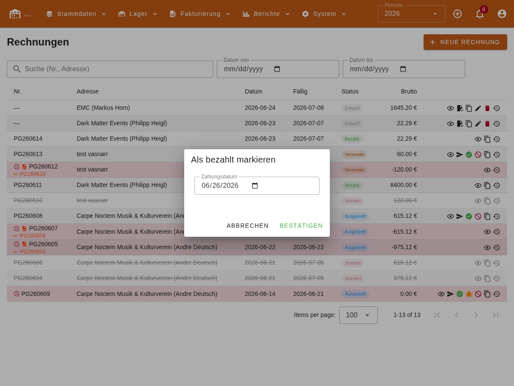

### 6.5 Überfällige Rechnungen

Ist eine ausgestellte/versendete Rechnung nach dem Fälligkeitsdatum noch nicht bezahlt, wird die Zeile **rot hervorgehoben** und mit einem Warnsymbol gekennzeichnet. Für solche Rechnungen erscheint die Aktion **Mahnung erstellen** (siehe [Abschnitt 7](#7-mahnungen-erstellen)).

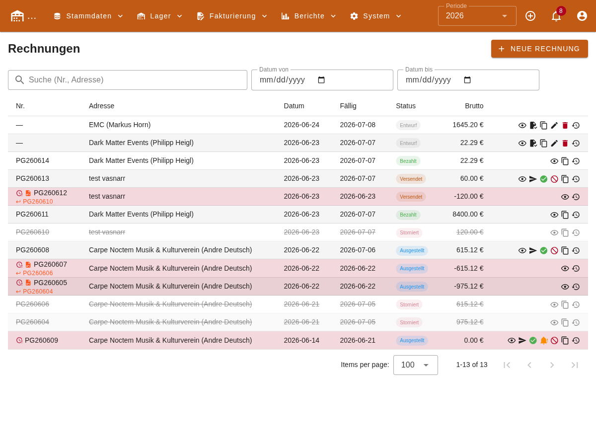

### 6.6 Rechnung stornieren (Storno)

Eine ausgestellte Rechnung kann nicht gelöscht, aber **storniert** werden:

1. **Stornieren**-Symbol (rotes Verbots-Symbol) anklicken.
2. **Stornierungsgrund** eingeben (Pflichtfeld).
3. Wählen, ob zusätzlich ein **neuer Rechnungsentwurf** aus der Originalrechnung erstellt werden soll (z. B. für eine Korrektur).
4. **Stornieren**.

Es entsteht eine **Stornorechnung**, die mit dem Bezug zur Originalrechnung (↩) verknüpft wird.

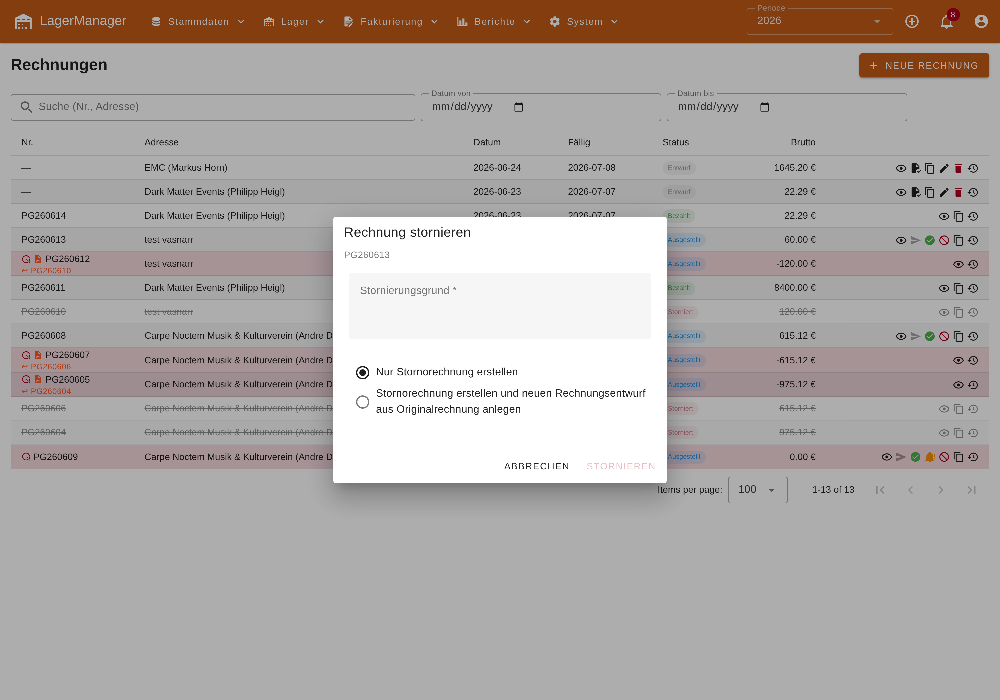

### 6.7 Weitere Aktionen

- **Senden** (Papierflieger-Symbol) – ausgestellte/versendete Rechnung per E-Mail versenden, siehe [Abschnitt 8](#8-vorschau-pdf-versand--verlauf). Bei Stornorechnungen nicht verfügbar.
- **Duplizieren** – erstellt eine Kopie als neuen Entwurf.
- **Bearbeiten** / **Löschen** – nur für Entwürfe.
- **Vorschau** / **Verlauf** – wie bei Angeboten.
- **Als Vorlage speichern** – siehe [Abschnitt 6.8](#68-rechnungsvorlagen).

### 6.8 Rechnungsvorlagen

Wiederkehrende Rechnungen (z. B. immer gleiche Positionen für einen bestimmten Zweck) lassen sich als **Vorlage** speichern und für neue Rechnungsentwürfe wiederverwenden. Eine Vorlage enthält die **Positionen** und **Anmerkungen**, jedoch **keine Adresse** – diese wird bei jeder neuen Rechnung individuell gewählt.

**Rechnung als Vorlage speichern:**

- Im Rechnungsdialog einer bereits gespeicherten Rechnung über die Schaltfläche **Als Vorlage speichern** unten im Dialog, oder
- direkt aus der Rechnungsliste über das Speichern-Symbol in der jeweiligen Zeile (nicht bei Stornorechnungen verfügbar).

In beiden Fällen wird ein **Vorlagenname** abgefragt und die Vorlage gespeichert.

**Neue Rechnung aus Vorlage erstellen:**

1. In der Rechnungsliste oben die Schaltfläche **Aus Vorlage** anklicken.
2. Im Auswahldialog die gewünschte Vorlage anklicken (Name und Bruttosumme werden angezeigt).
3. Es öffnet sich ein neuer Rechnungsentwurf mit den Positionen und Anmerkungen der Vorlage; nur die **Adresse** muss noch ergänzt werden.

Im selben Auswahldialog können Vorlagen über die Symbole am rechten Rand **umbenannt** oder **gelöscht** werden.

---

## 7. Mahnungen erstellen

Mahnungen sind Zahlungserinnerungen zu überfälligen Rechnungen und werden in **Mahnstufen** geführt. Die Anzahl der Stufen ist über die Einstellung **Maximale Mahnstufe** konfigurierbar (Vorgabe: 3).

### 7.1 Mahnung aus einer überfälligen Rechnung erzeugen (empfohlen)

1. In der **Rechnungsliste** bei der überfälligen Rechnung das Symbol **Mahnung erstellen** (Glocken-Symbol) anklicken.
2. Es wird automatisch ein **Mahnungsentwurf** zur betreffenden Rechnung angelegt und in der Mahnungsansicht geöffnet.

> Das Glocken-Symbol **Mahnung erstellen** erscheint bei überfälligen Rechnungen am rechten Zeilenrand – siehe Rechnungsliste oben.

### 7.2 Mahnung manuell anlegen

1. **Fakturierung → Mahnungen → Neue Mahnung**.
2. Felder ausfüllen:
   - **Rechnung** (Pflichtfeld) – die zu mahnende Rechnung auswählen.
   - **Mahnstufe** (1 bis zur konfigurierten maximalen Mahnstufe).
   - **Mahnungsdatum** (Pflichtfeld, vorbelegt mit heute).
   - **Zahlungsfrist** (Pflichtfeld) – darf nicht vor dem Mahnungsdatum liegen.
   - **Mahngebühr (€)** – vorbelegt mit der Standard-Mahngebühr.
   - **Anmerkungen**.
3. **Speichern** (Status **Entwurf**).

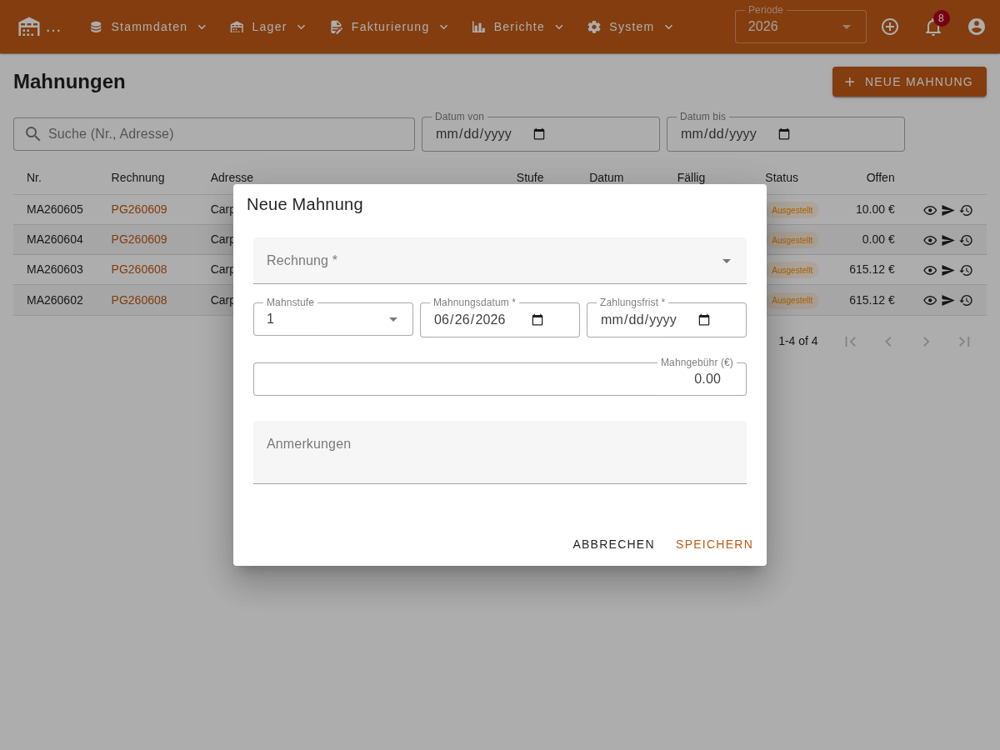

### 7.3 Mahnung ausstellen

Über das **Ausstellen**-Symbol wird die Mahnungsnummer vergeben und der Status auf **Ausgestellt** gesetzt.

### 7.4 Mahnungsliste

Die Liste zeigt u. a. Mahnungsnummer, verknüpfte **Rechnung** (anklickbar zur Vorschau), Adresse, **Stufe** (farblich: höchste konfigurierte Stufe rot, vorletzte Stufe orange), Datum, Fälligkeit, Status und den **offenen Betrag**.

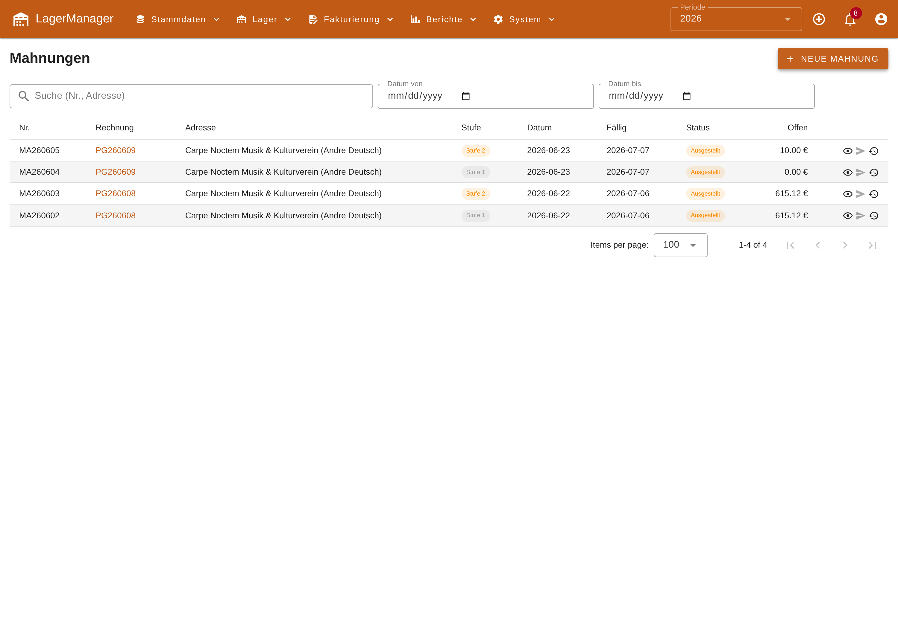

> Entwürfe können bearbeitet und gelöscht werden; ausgestellte Mahnungen nicht.

> Ist bei einer Mahnung die **höchste konfigurierte Mahnstufe** erreicht, wird auf dem Mahnungsdokument statt der Stufennummer der Text **„Letzte Mahnung"** angezeigt.

Ausgestellte Mahnungen können über das **Senden**-Symbol (Papierflieger) per E-Mail an den Empfänger verschickt werden – siehe [Abschnitt 8](#8-vorschau-pdf-versand--verlauf).

---

## 8. Vorschau, PDF, Versand & Verlauf

> Schlägt eine Aktion in den Dialogen für Angebote, Rechnungen oder Mahnungen fehl (z. B. beim Speichern oder Laden), erscheint unten am Bildschirmrand eine Fehlermeldung mit dem Grund, statt dass die Aktion ohne Rückmeldung erfolglos bleibt.

### Vorschau / PDF

Über das **Augen-Symbol** (oder Klick auf eine ausgestellte Zeile) öffnet sich die **Dokumentvorschau** als fertig gesetztes Dokument. Oben rechts steht **PDF herunterladen** zur Verfügung, um das Dokument als PDF zu speichern und anschließend zu drucken oder zu versenden.

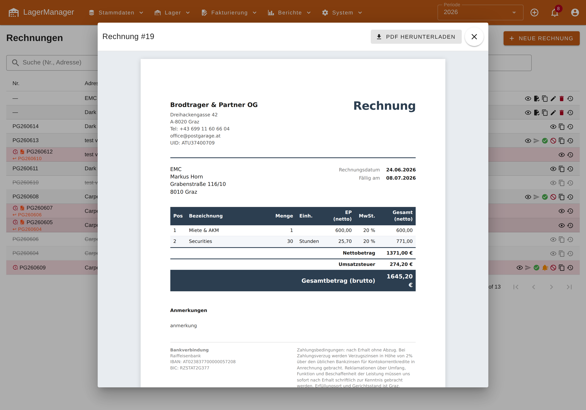

> Vorhandene **Anmerkungen** werden auf dem Dokument oberhalb der Positionstabelle angezeigt (ohne eigene Überschrift). Geldbeträge werden mit Tausenderpunkt dargestellt, z. B. `1.234,56 €`.

### E-Mail-Versand

Ausgestellte (und bereits versendete) Angebote, Rechnungen und Mahnungen können direkt aus der Anwendung per E-Mail an den Empfänger geschickt werden. Das Dokument wird dabei automatisch als **PDF-Anhang** beigefügt – es muss nichts manuell hochgeladen werden.

1. In der jeweiligen Liste (**Angebote**, **Rechnungen** oder **Mahnungen**) in der Zeile das **Senden**-Symbol (Papierflieger) anklicken.
2. Der Dialog **Dokument versenden** öffnet sich. Vorbelegt sind:
   - **An** – die E-Mail-Adresse aus der hinterlegten Adresse (kann überschrieben oder ergänzt werden; Pflichtfeld).
   - **Betreff** und **Nachricht** – aus den in den [Einstellungen](#1-überblick--voraussetzungen) hinterlegten Vorlagen, wobei Platzhalter wie `{number}` und `{company}` automatisch durch die tatsächlichen Werte ersetzt sind.
3. Text bei Bedarf anpassen und auf **Senden** klicken.

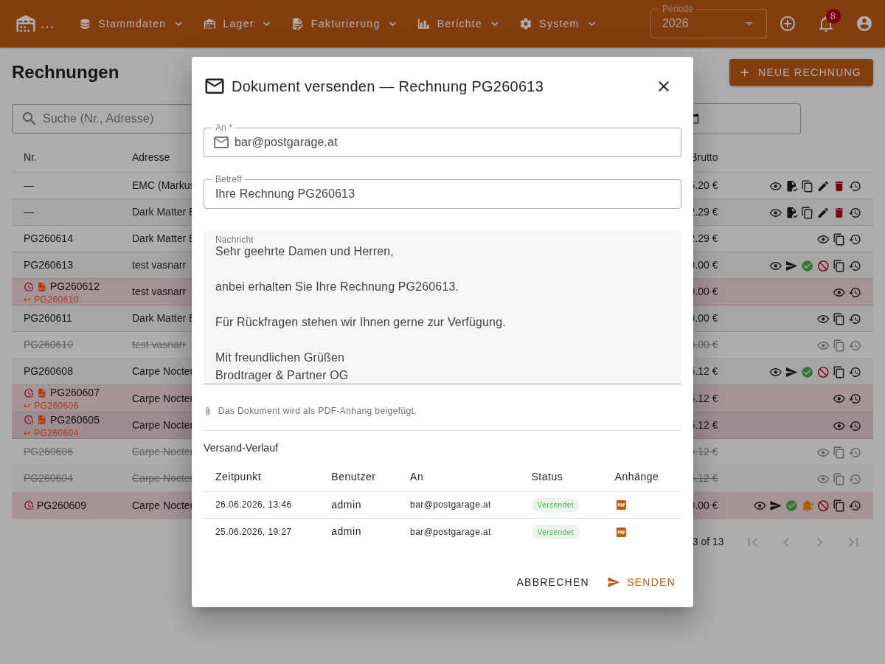

**Hinweise:**

- Bei **Angeboten** und **Rechnungen** wechselt der Status nach erfolgreichem Versand automatisch auf **Versendet**. **Mahnungen** besitzen keinen eigenen Versendet-Status und bleiben **Ausgestellt** (sie können bei Bedarf erneut versendet werden).
- Jeder Sendeversuch wird protokolliert: Der **Versand-Verlauf** im unteren Teil des Dialogs listet Zeitpunkt, Benutzer, Empfänger, Status (**Versendet** / **Fehler**) sowie die mitgesendeten PDF-Anhänge (anklickbar) auf.
- Schlägt der Versand fehl (z. B. ungültige Empfängeradresse oder ein SMTP-Problem), erscheint eine Fehlermeldung; auch der Fehlversuch wird im Verlauf festgehalten.
- **Stornorechnungen** können nicht versendet werden – für sie wird kein Senden-Symbol angezeigt.

### Verlauf

Das **Uhr-Symbol** (Verlauf) zeigt zu jedem Dokument und jeder Adresse die Änderungshistorie (wer hat wann was geändert).

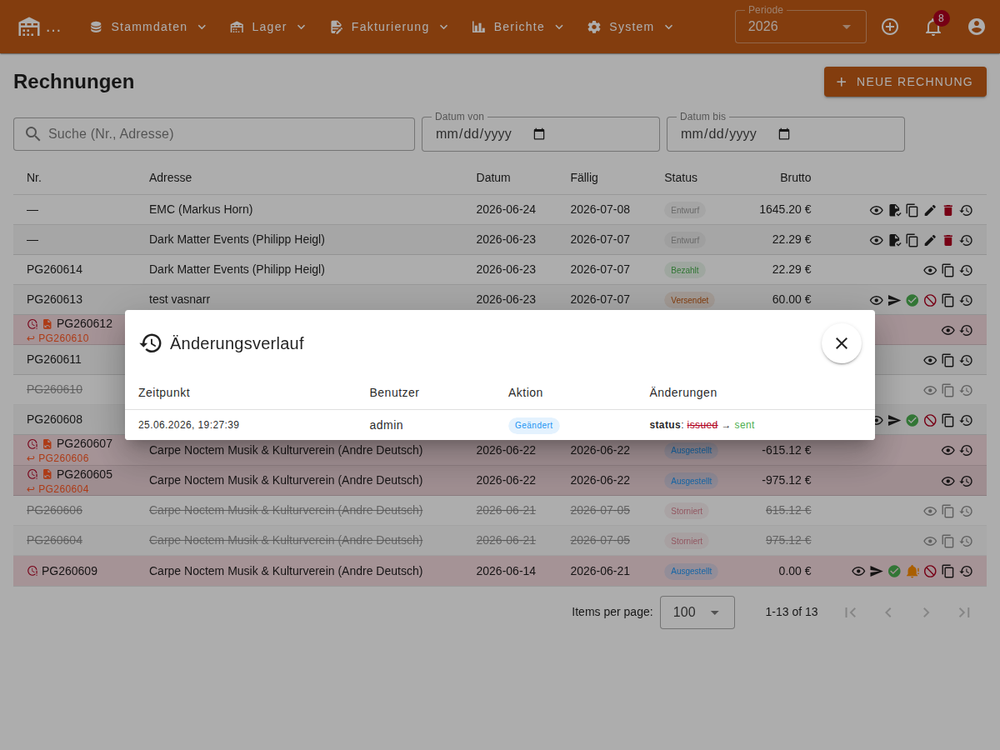

---

## 9. Statusübersicht

### Angebote

| Status | Bedeutung |
|--------|-----------|
| **Entwurf** | Bearbeitbar, noch keine Nummer |
| **Ausgestellt** | Nummer vergeben, festgeschrieben |
| **Versendet** | An Kunden geschickt |
| **Angenommen** | Vom Kunden angenommen |
| **Abgelehnt** | Vom Kunden abgelehnt |
| **Umgewandelt** | In eine Rechnung umgewandelt |

### Rechnungen

| Status | Bedeutung |
|--------|-----------|
| **Entwurf** | Bearbeitbar, noch keine Nummer |
| **Ausgestellt** | Nummer vergeben, festgeschrieben |
| **Versendet** | An Kunden geschickt |
| **Bezahlt** | Zahlung erfasst |
| **Storniert** | Durch Stornorechnung aufgehoben |

### Mahnungen

| Status | Bedeutung |
|--------|-----------|
| **Entwurf** | Bearbeitbar, noch keine Nummer |
| **Ausgestellt** | Nummer vergeben |
| **Bezahlt** | Zugrunde liegende Rechnung beglichen |

---

## Anhang: Änderungsprotokoll

Kurze Übersicht der Änderungen an der Fakturierung seit der letzten größeren Überarbeitung dieses Handbuchs, neueste zuerst:

| Datum | Änderung |
|-------|----------|
| Juli 2026 | Neues Feld **Leistungsdatum** bei Rechnungen; **Rechnungsdatum** und **Fälligkeitsdatum** werden nicht mehr im Entwurf erfasst, sondern automatisch beim Ausstellen gesetzt. |
| Juli 2026 | Geldbeträge auf Angeboten, Rechnungen und Mahnungen werden jetzt mit Tausenderpunkt dargestellt (z. B. `1.234,56 €`). |
| Juli 2026 | Anmerkungen erscheinen auf dem Dokument jetzt oberhalb der Positionen, ohne eigene Überschrift „Anmerkungen". |
| Juli 2026 | Neu: **Rechnungsvorlagen** – Positionen und Anmerkungen einer Rechnung als Vorlage speichern und für neue Rechnungen wiederverwenden. |
| Juli 2026 | Positionen in Angeboten und Rechnungen können jetzt per Drag-and-Drop oder über Pfeiltasten neu angeordnet werden. |
| Juli 2026 | Zahlenfelder (z. B. Menge, Preis) unterstützen jetzt einfache Rechenformeln, z. B. `=12*3,5`. |
| Juli 2026 | Fehler beim Speichern oder Laden von Angeboten, Rechnungen und Mahnungen werden jetzt als Meldung angezeigt, statt kommentarlos zu scheitern. |
| Juni 2026 | Die maximale Mahnstufe ist jetzt über die Einstellungen konfigurierbar; bei Erreichen erscheint auf der Mahnung „Letzte Mahnung" statt der Stufennummer. |
| Juni 2026 | Die Mahngebühr wird beim Anlegen einer neuen Mahnung automatisch aus den Einstellungen vorbefüllt. |

---

*Stand: Juli 2026*
