# Benutzerhandbuch – Fakturierung

Anleitung zum Erstellen von **Angeboten**, **Rechnungen** und **Mahnungen** sowie zur Verwaltung von **Adressen** im LagerManager.

> **Hinweis zu Screenshots:** Alle Abbildungen in diesem Handbuch liegen als Bilddateien unter `docs/img/fakturierung/`.

---

## Inhaltsverzeichnis

1. [Überblick & Voraussetzungen](#1-überblick--voraussetzungen)
    - [Einmalige Voraussetzungen (Einstellungen)](#einmalige-voraussetzungen-einstellungen)
2. [Wo finde ich die Fakturierung?](#2-wo-finde-ich-die-fakturierung)
3. [Kunden & Adressen verwalten](#3-kunden--adressen-verwalten)
    - [3.0 Kunden](#30-kunden)
    - [3.1 Adressen](#31-adressen)
4. [Faktura-Artikel](#4-faktura-artikel)
5. [Angebote erstellen](#5-angebote-erstellen)
    - [5.1 Neues Angebot anlegen](#51-neues-angebot-anlegen)
    - [5.2 Positionen erfassen](#52-positionen-erfassen)
    - [5.3 Angebot ausstellen](#53-angebot-ausstellen)
    - [5.4 Status weitersetzen](#54-status-weitersetzen)
    - [5.5 Angebot in Rechnung umwandeln](#55-angebot-in-rechnung-umwandeln)
    - [5.6 Weitere Aktionen](#56-weitere-aktionen)
6. [Rechnungen erstellen](#6-rechnungen-erstellen)
    - [6.1 Neue Rechnung anlegen](#61-neue-rechnung-anlegen)
    - [6.2 Positionen erfassen](#62-positionen-erfassen)
    - [6.3 Rechnung ausstellen](#63-rechnung-ausstellen)
    - [6.4 Zahlungen erfassen (auch Teilzahlungen)](#64-zahlungen-erfassen-auch-teilzahlungen)
    - [6.5 Überfällige Rechnungen](#65-überfällige-rechnungen)
    - [6.6 Rechnung stornieren (Storno)](#66-rechnung-stornieren-storno)
    - [6.7 Weitere Aktionen](#67-weitere-aktionen)
    - [6.8 Rechnungsvorlagen](#68-rechnungsvorlagen)
7. [Mahnungen erstellen](#7-mahnungen-erstellen)
    - [7.1 Mahnung aus einer überfälligen Rechnung erzeugen (empfohlen)](#71-mahnung-aus-einer-überfälligen-rechnung-erzeugen-empfohlen)
    - [7.2 Mahnung manuell anlegen](#72-mahnung-manuell-anlegen)
    - [7.3 Mahnung ausstellen](#73-mahnung-ausstellen)
    - [7.4 Mahnungsliste](#74-mahnungsliste)
8. [Vorschau, PDF, Versand & Verlauf](#8-vorschau-pdf-versand--verlauf)
    - [Vorschau / PDF](#vorschau--pdf)
    - [Anhänge](#anhänge)
        - [Berichtigungsnoten](#berichtigungsnoten)
    - [E-Mail-Versand](#e-mail-versand)
    - [Verlauf](#verlauf)
9. [Statusübersicht](#9-statusübersicht)
    - [Angebote](#angebote)
    - [Rechnungen](#rechnungen)
    - [Mahnungen](#mahnungen)
10. [Anhang: Änderungsprotokoll](#anhang-änderungsprotokoll)

---

## 1. Überblick & Voraussetzungen

Die Fakturierung ist Teil des Lager Managers V2 und unter [https://172.16.73.1/invoices](https://172.16.73.1/invoices) erreichbar (Voraussetzung: aktives VPN).

Die Fakturierung umfasst fünf zusammenhängende Bereiche:

| Bereich | Zweck |
|---------|-------|
| **Kunden** | Rechnungsempfänger; trägt Kundennummer und Saldo |
| **Adressen** | Anschriften eines Kunden; eine davon ist die Standardadresse |
| **Angebote** | Unverbindliche Kostenvoranschläge, können in Rechnungen umgewandelt werden |
| **Rechnungen** | Verbindliche Zahlungsaufforderungen |
| **Mahnungen** | Zahlungserinnerungen zu überfälligen Rechnungen |

**Typischer Ablauf:**

```
Kunde + Adresse anlegen  →  Angebot  →  (Umwandeln)  →  Rechnung
→  (bei Überfälligkeit)  →  Mahnung
```

**Ein Angebot ist nicht zwingend – eine Rechnung kann auch direkt erstellt werden.**

### Einmalige Voraussetzungen (Einstellungen)

Damit die erzeugten Dokumente korrekt aussehen, sollten unter **Verwaltung → Einstellungen** einmalig die Firmendaten hinterlegt werden. Diese erscheinen als Absender bzw. in der Fußzeile der PDF-Dokumente:

- **Firmenlogo** – Bilddatei (PNG, JPEG, GIF, WebP oder SVG), die oben im PDF erscheint. Über **Logo hochladen** auswählen; mit **Logo entfernen** wieder löschen. Eine Vorschau wird direkt angezeigt.
- **Firmenname**, **Straße**, **PLZ**, **Ort**
- **UID-Nummer**, **E-Mail**, **Telefon**
- **IBAN**, **BIC**, **Bankname** (für die Zahlungsinformationen)
- **Fußzeilen-Text** für Rechnungen/Angebote
- **Standard-Zahlungsziel in Tagen** (Vorgabe: 14) – bestimmt das beim Ausstellen einer Rechnung vorgeschlagene Fälligkeitsdatum
- **Standard-Mahngebühr** in Euro
- **Maximale Mahnstufe** (Vorgabe: 3) – ist die höchste Mahnstufe erreicht, erscheint auf der Mahnung „Letzte Mahnung" statt der Stufennummer
- **Nummernpräfixe** für Angebote (Vorgabe `AN`), Rechnungen (`RE`) und Mahnungen (`MA`)
- **Anhangstypen, die im Versand-Dialog vorausgewählt sind** (Gruppe **Dokument-Anhänge**) – Auswahl der Anhangsarten, die im [Versand-Dialog](#e-mail-versand) von vornherein angekreuzt sind (Vorgabe: **Ergänzung** und **Datei**). Ohne Auswahl ist nichts vorausgewählt. [Berichtigungsnoten](#berichtigungsnoten) werden unabhängig davon immer mitgeschickt.
- **E-Mail-Betreff** und **E-Mail-Text** je Dokumentart (Angebot, Rechnung, Mahnung) für den [E-Mail-Versand](#8-vorschau-pdf-versand--verlauf). In den Vorlagen werden die Platzhalter `{number}` (Dokumentnummer), `{company}` (Firmenname) und `{recipient_name}` (Empfänger) beim Versand automatisch ersetzt.

> Die Dokumentnummern werden automatisch im Format `PRÄFIXJJMM##` vergeben (z. B. `RE260601` für die erste Rechnung im Juni 2026). Die Nummer wird erst beim **Ausstellen** vergeben.

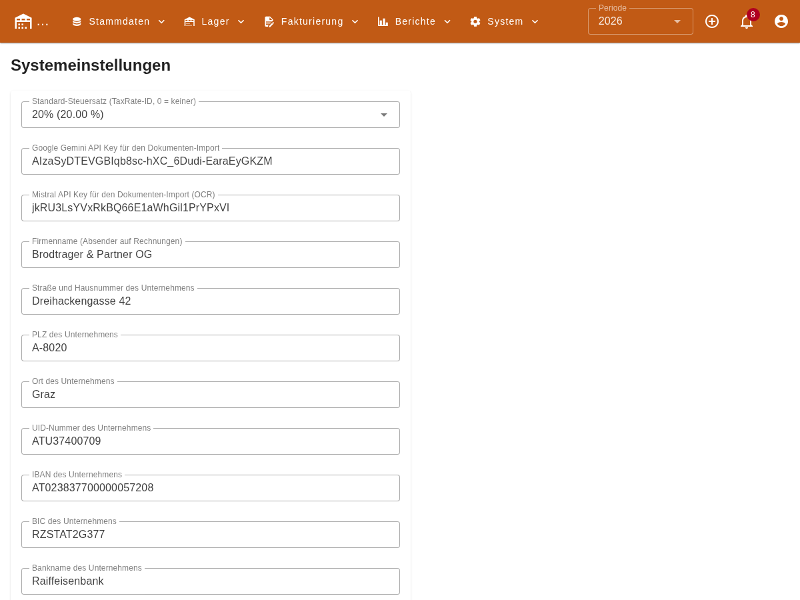

Die E-Mail-Vorlagen befinden sich weiter unten auf derselben Seite:

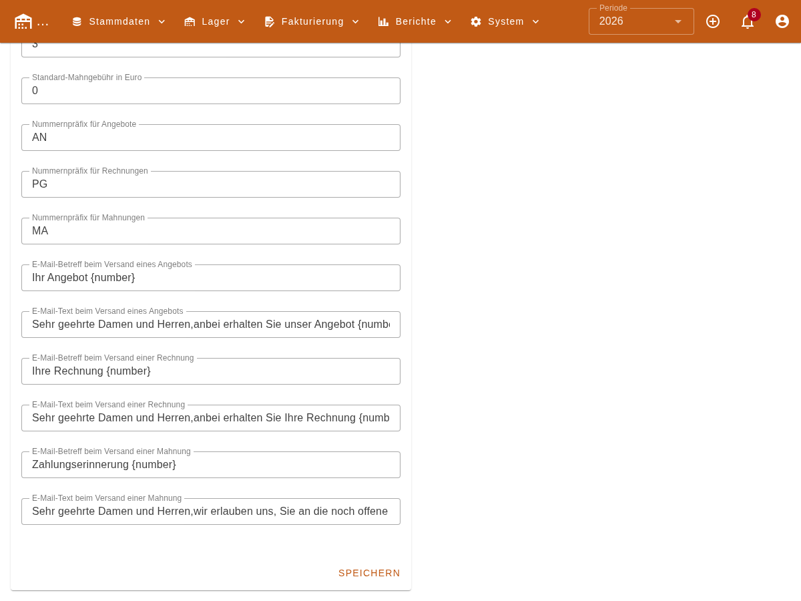

Darunter folgt die Gruppe **Dokument-Anhänge** mit der Vorauswahl für den Versand-Dialog:

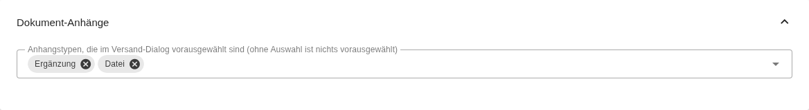

> Der **Absender**, die **SMTP-Zugangsdaten** sowie eine optionale **Reply-To-Adresse** (`DEFAULT_REPLY_TO_EMAIL`) für den tatsächlichen Mailversand werden serverseitig (Umgebungs-/Serverkonfiguration) hinterlegt. Ist `DEFAULT_REPLY_TO_EMAIL` gesetzt, wird diese Adresse als Reply-To-Header aller ausgehenden Dokument-E-Mails verwendet.

---

## 2. Wo finde ich die Fakturierung?

Alle Funktionen befinden sich in der oberen Navigationsleiste im Menü **Fakturierung**:

- **Artikel** – Faktura-Artikel (Stammdaten für Positionen)
- **Angebote**
- **Rechnungen**
- **Mahnungen**

**Kunden** und **Adressen** befinden sich im Menü **Stammdaten**.

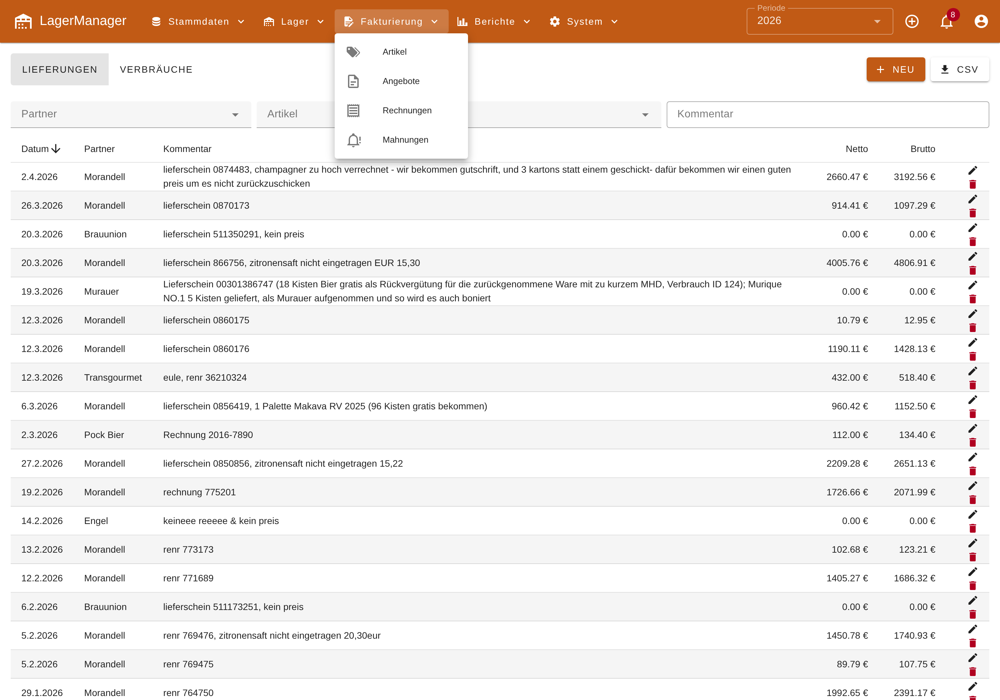

> **Berechtigungen:** Die einzelnen Punkte sind nur sichtbar, wenn das Benutzerkonto die jeweilige Berechtigung besitzt (Angebote, Rechnungen, Mahnungen, Kunden, Adressen). Fehlt eine Berechtigung, ist der Menüpunkt ausgeblendet.

---

## 3. Kunden & Adressen verwalten

### 3.0 Kunden

Ein **Kunde** ist der Empfänger einer Rechnung und derjenige, für den ein **Saldo** geführt wird.
Jeder Kunde kann **mehrere Adressen** haben (z. B. Rechnungs- und Lieferadresse); eine davon ist die
**Standardadresse** und wird bei neuen Dokumenten vorausgewählt.

Menü **Stammdaten → Kunden**:

- Jeder Kunde erhält automatisch eine **Kundennummer** (K0001, K0002, …), die auch auf der Rechnung erscheint.
- Die Spalte **Saldo** zeigt den Kontostand: **rot/negativ** = der Kunde schuldet Geld,
  **grün/positiv** = der Kunde hat ein **Guthaben**.
- Das Symbol **Kundenkonto** (Buch) listet alle Bewegungen mit Datum, Betrag, laufendem Saldo und
  Benutzer auf. Ein Klick auf eine Bewegung öffnet die gefilterte Rechnungs- bzw. Mahnungsliste.

Der Saldo ergibt sich automatisch:

| Vorgang | Wirkung auf den Saldo |
|---------|------------------------|
| Rechnung ausstellen | − Rechnungsbetrag (brutto) |
| Mahnung mit Gebühr ausstellen | − Mahngebühr |
| Zahlung erfassen | + Zahlbetrag |
| Rechnung stornieren | Rechnungsbetrag und Mahngebühren werden gutgeschrieben |

**Anzahlung erfassen:** im Kundenkonto auf **Zahlung erfassen** klicken. Der Betrag erhöht den Saldo
und steht als **Guthaben** bereit, ohne einer Rechnung zugeordnet zu sein.

> Beim Anlegen einer Adresse ohne Kunden wird automatisch ein passender Kunde erzeugt. Beim
> WZ-Abgleich erhält jede importierte Adresse ebenfalls einen eigenen Kunden.

### 3.1 Adressen

Adressen sind die Empfänger von Angeboten, Rechnungen und Mahnungen. Sie werden einmal angelegt und können danach in beliebig vielen Dokumenten verwendet werden.

#### Adressliste öffnen

**Stammdaten → Adressen**. Die Tabelle zeigt Name/Firma, Ort, E-Mail und Telefon. Über das Suchfeld kann nach beliebigem Text gefiltert werden.

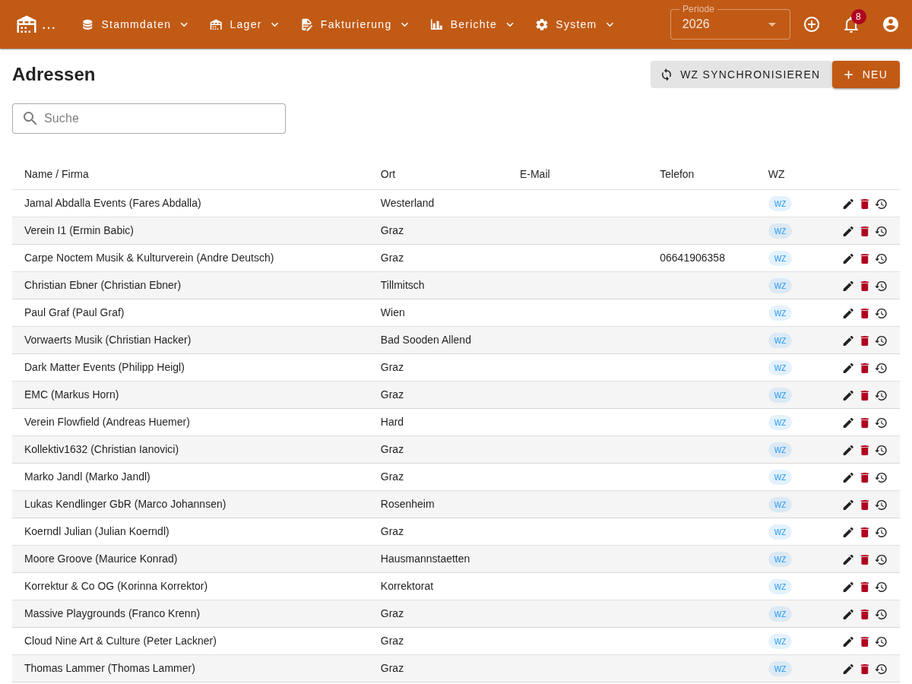

#### Neue Adresse anlegen

1. Schaltfläche **Neu** (oben rechts) anklicken.
2. Im Dialog die Felder ausfüllen:
   - **Anrede**, **Vorname**, **Nachname**
   - **Firma**, **Abteilung**
   - **Straße**, **PLZ**, **Ort**
   - **Telefon**, **E-Mail**
   - **UID-Nummer**
   - **Anmerkung**
3. **Speichern**.

> Alle Felder sind optional – es genügt z. B. ein Firmenname *oder* ein Vor-/Nachname. Der angezeigte Name wird automatisch aus Firma bzw. Name gebildet.

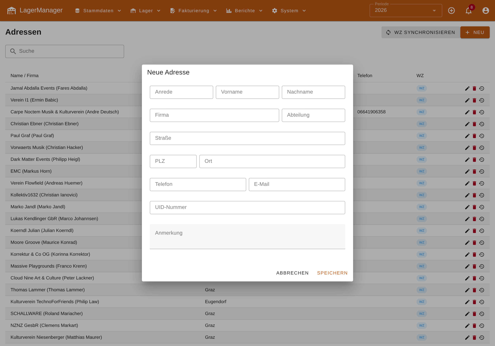

#### Adresse bearbeiten / löschen

- **Bearbeiten:** Zeile anklicken oder das Stift-Symbol verwenden.
- **Löschen:** Mülleimer-Symbol in der Zeile; es folgt eine Sicherheitsabfrage.

#### Adressen aus Wiffzack (WZ) synchronisieren

Über **WZ synchronisieren** können Adressen aus dem Wiffzack-Kassensystem übernommen werden. Im Dialog werden die Verbindungsdaten (Host, Datenbank, Benutzer, Passwort) eingegeben und mit **Synchronisieren** bestätigt. Übernommene Adressen sind in der Liste mit dem Kennzeichen **WZ** markiert.

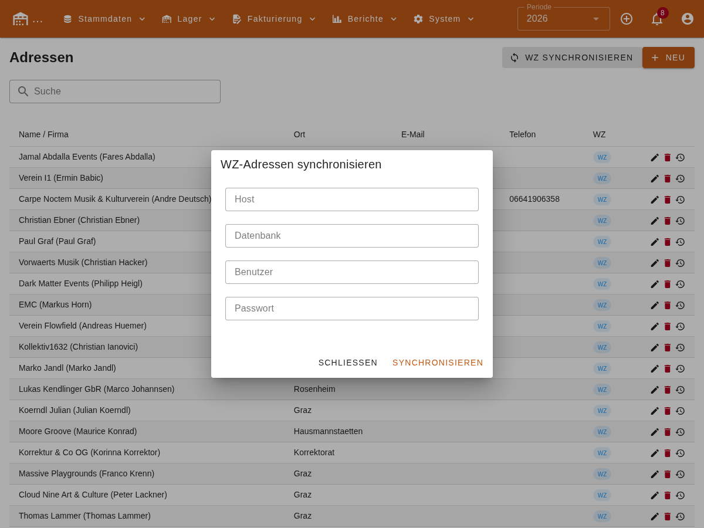

> **Tipp:** Eine neue Adresse kann auch direkt während der Angebots- oder Rechnungserstellung über das **+**-Symbol neben dem Adressfeld angelegt werden – ohne den Bereich zu wechseln.

---

## 4. Faktura-Artikel

Faktura-Artikel sind wiederkehrende Positionen (z. B. "Miete", „AKM") mit vordefinierter Bezeichnung, Einheit, Preis und Steuersatz. Sie ersparen die manuelle Eingabe in jedem Dokument.

**Fakturierung → Artikel → Neuer Artikel:**

- **Artikel-Nr.** (leer lassen für automatische Vergabe)
- **Bezeichnung** (Pflichtfeld)
- **Beschreibung**
- **Einheit** (z. B. Std., Stk., Pauschale)
- **Preis (netto)**
- **Steuersatz**
- **Aktiv** (nur aktive Artikel stehen in Dokumenten zur Auswahl)

Die Artikelliste zeigt die **Beschreibung** als eigene Spalte an (gekürzt mit Tooltip für längere Texte).

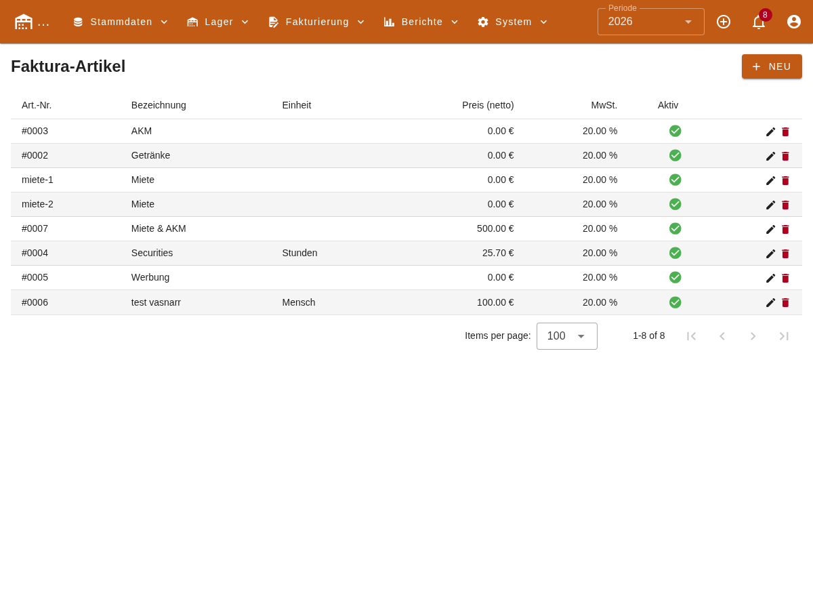

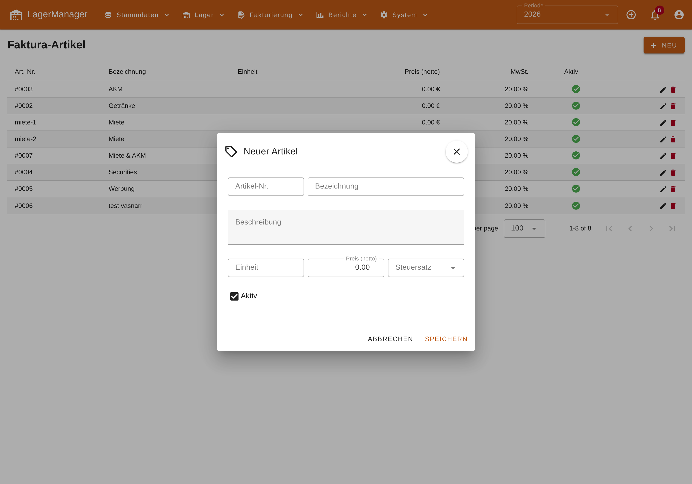

> Positionen können in Dokumenten auch als **Freitext** ohne hinterlegten Artikel erfasst werden. Ein Artikel ist also keine Pflicht.

---

## 5. Angebote erstellen

### 5.1 Neues Angebot anlegen

1. **Fakturierung → Angebote** öffnen.
2. **Neues Angebot** anklicken.
3. **Kopfdaten** ausfüllen:
   - **Adresse** (Pflichtfeld) – aus der Liste wählen oder über **+** neu anlegen.
   - **Datum** (Pflichtfeld, vorbelegt mit dem heutigen Tag).
   - **Gültig bis** – optionales Ablaufdatum des Angebots (darf nicht vor dem Angebotsdatum liegen).
   - **Anmerkungen** – freier Text, erscheint auf dem Dokument.

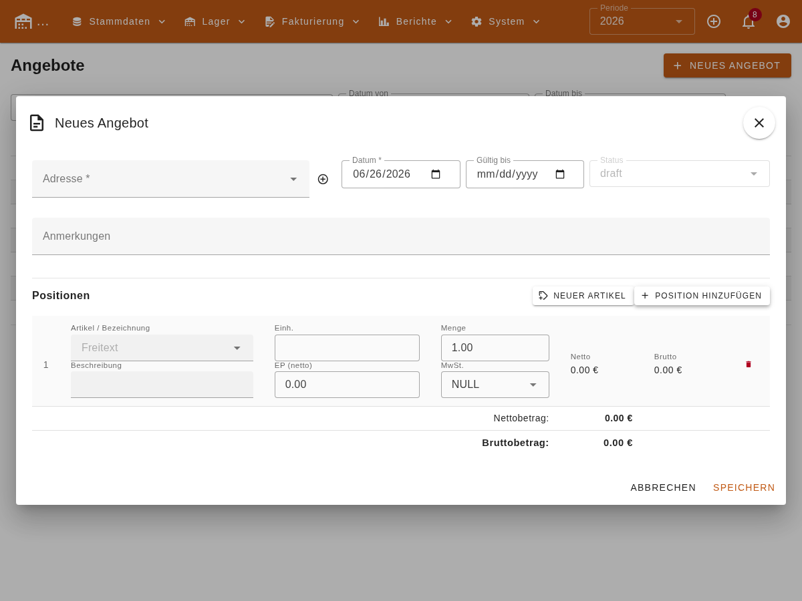

### 5.2 Positionen erfassen

Im Abschnitt **Positionen**:

- **Position hinzufügen** – fügt eine leere Zeile hinzu.
- **Neuer Artikel** – legt sofort einen neuen Faktura-Artikel an und übernimmt ihn als Position.

Pro Position werden erfasst:

| Feld | Bedeutung |
|------|-----------|
| **Artikel / Bezeichnung** | Faktura-Artikel auswählen *oder* leer lassen für Freitext. Artikel mit Beschreibung werden im Dropdown als „Name – Beschreibung" angezeigt (Beschreibung auf 50 Zeichen gekürzt). |
| **Beschreibung** | Freitext (bei Artikeln automatisch befüllt) |
| **Einh.** | Einheit (z. B. Stk., Std.) |
| **Menge** | Stückzahl/Menge |
| **EP (netto)** | Einzelpreis netto |
| **MwSt.** | Steuersatz |

**Netto-** und **Bruttobetrag** werden je Zeile sowie als Gesamtsumme automatisch berechnet und am Tabellenende angezeigt.

Eine Position wird über das rote Mülleimer-Symbol am Zeilenende entfernt.

> Die Positionstabelle mit den automatisch berechneten Netto-/Bruttosummen ist im Dialog-Screenshot oben sichtbar.

> **Positionen umsortieren:** Solange das Dokument bearbeitbar ist, kann die Reihenfolge der Positionen per **Drag-and-Drop** an der Positionsnummer oder über die kleinen **Pfeil-hoch/-runter-Symbole** daneben geändert werden. Die Reihenfolge bestimmt die Position („Pos"-Spalte) auf dem gedruckten Dokument.

> **Tipp – Formeln in Zahlenfeldern:** In Zahlenfeldern wie **Menge** oder **EP (netto)** kann statt eines Werts auch eine einfache Rechenformel eingegeben werden, beginnend mit `=` (z. B. `=12*3,5` oder `=(2+3)*4`). Nach Bestätigen mit Enter oder Verlassen des Felds wird das Ergebnis berechnet und eingesetzt. Ist die Formel ungültig, wird `NaN` angezeigt und das Speichern verhindert; beim erneuten Anklicken des Felds erscheint die ursprüngliche Formel wieder zur Korrektur.

4. **Speichern**. Das Angebot wird zunächst als **Entwurf** angelegt.

### 5.3 Angebot ausstellen

Ein Entwurf kann beliebig bearbeitet werden. Erst beim **Ausstellen** wird die Angebotsnummer vergeben:

- In der Angebotsliste das Symbol **Ausstellen** (Dokument-mit-Häkchen-Symbol) in der Zeile anklicken und bestätigen.
- Der Status wechselt von **Entwurf** auf **Ausgestellt**.

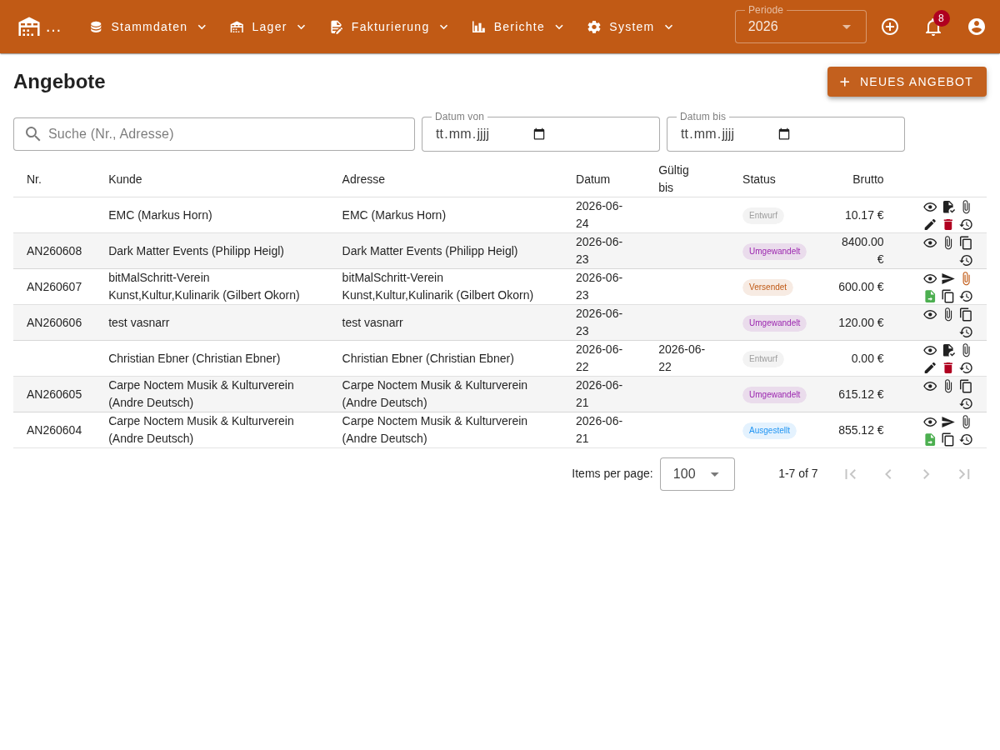

### 5.4 Status weitersetzen

Bei ausgestellten Angeboten kann der Status manuell auf **Versendet**, **Angenommen** oder **Abgelehnt** gesetzt werden (über den Bearbeiten-/Status-Dialog). Beim [E-Mail-Versand](#8-vorschau-pdf-versand--verlauf) wird der Status **Versendet** automatisch gesetzt.

### 5.5 Angebot in Rechnung umwandeln

Aus einem ausgestellten, versendeten oder angenommenen Angebot lässt sich direkt eine Rechnung erzeugen:

1. In der Zeile das grüne Symbol **In Rechnung umwandeln** anklicken.
2. Abfrage bestätigen.
3. Es wird automatisch ein **Rechnungsentwurf** mit denselben Positionen erstellt und geöffnet. Das ursprüngliche Angebot erhält den Status **Umgewandelt**.

> Die Aktions-Symbole (inkl. „In Rechnung umwandeln") befinden sich am rechten Rand jeder Zeile – siehe Angebotsliste oben.

### 5.6 Weitere Aktionen

- **Vorschau** (Augen-Symbol) – Dokumentvorschau, siehe [Abschnitt 8](#8-vorschau-pdf-versand--verlauf).
- **Senden** (Papierflieger-Symbol) – Angebot per E-Mail versenden, siehe [Abschnitt 8](#8-vorschau-pdf-versand--verlauf).
- **Anhänge** (Büroklammer-Symbol) – Ergänzungen, Berichtigungsnoten und Dateien zum Angebot verwalten, siehe [Abschnitt 8](#anhänge).
- **Kopieren** (bei nicht-Entwürfen) – legt ein Duplikat als neuen Entwurf an.
- **Bearbeiten** / **Löschen** – nur für Entwürfe verfügbar.
- **Verlauf** (Uhr-Symbol) – Änderungshistorie.

> Beim Überfahren einer Zeile mit der Maus wird eine Schnellvorschau der Positionen eingeblendet.

---

## 6. Rechnungen erstellen

### 6.1 Neue Rechnung anlegen

1. **Fakturierung → Rechnungen** öffnen.
2. **Neue Rechnung** anklicken.
3. **Kopfdaten** ausfüllen:
   - **Adresse** (Pflichtfeld).
   - **Leistungsdatum** (optional) – Datum, an dem die Leistung tatsächlich erbracht wurde. Bleibt es leer, gilt auf dem Dokument das Rechnungsdatum als Leistungsdatum.
   - **Anmerkungen**.

> Ein **Rechnungsdatum** wird im Entwurf nicht mehr manuell erfasst: Es wird zusammen mit dem Fälligkeitsdatum erst beim [Ausstellen](#63-rechnung-ausstellen) automatisch gesetzt.

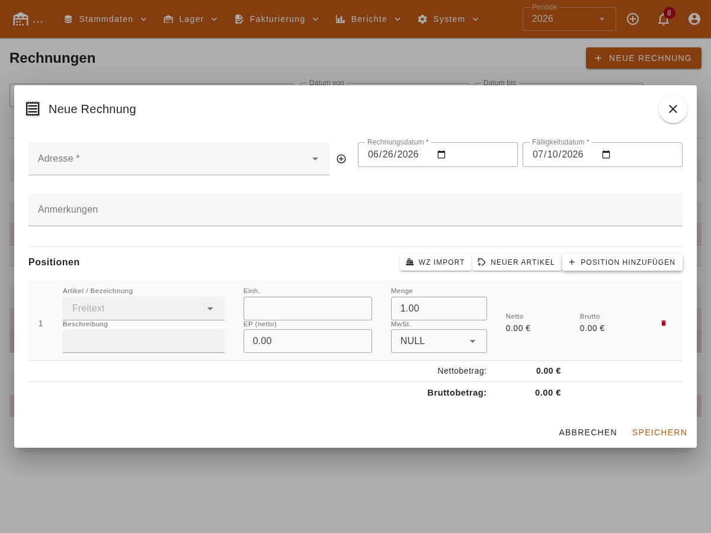

### 6.2 Positionen erfassen

Die Positionserfassung funktioniert identisch zum Angebot (siehe [5.2](#52-positionen-erfassen)). Zusätzlich steht bei Rechnungen zur Verfügung:

- **WZ Import** – übernimmt Positionen oder Text aus dem Wiffzack-Kassensystem.

> Die Schaltfläche **WZ Import** ist im Rechnungsdialog oben rechts über der Positionstabelle zu sehen.

4. **Speichern** – die Rechnung wird als **Entwurf** angelegt.

### 6.3 Rechnung ausstellen

Beim **Ausstellen** (Dokument-mit-Häkchen-Symbol) wird die Rechnungsnummer vergeben. Danach sind Kopfdaten und Positionen **nicht mehr veränderbar**.

Das **Rechnungsdatum** wird dabei automatisch auf das heutige Datum gesetzt. Im Dialog muss nur noch das **Fälligkeitsdatum** bestätigt bzw. angepasst werden – vorbelegt anhand des Standard-Zahlungsziels (heute + konfigurierte Anzahl Tage, siehe [Einstellungen](#1-überblick--voraussetzungen)). Es darf nicht vor dem heutigen Tag liegen.

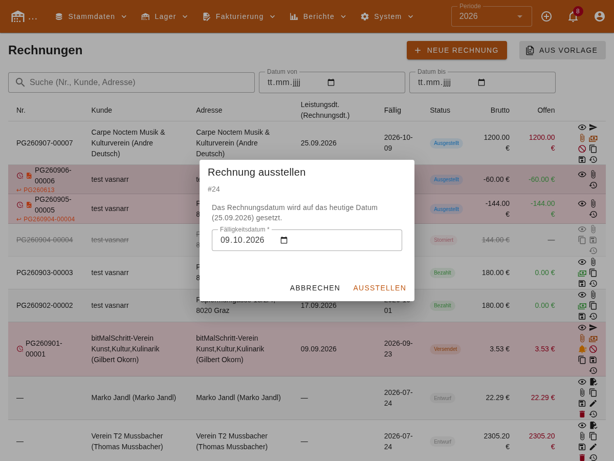

Hat der Kunde ein **Guthaben**, wird es beim Ausstellen automatisch verrechnet. Der Dialog zeigt vorher, wie viel verrechnet wird und was zu zahlen
bleibt. Die Verrechnung erscheint unter [Zahlungen](#64-zahlungen-erfassen-auch-teilzahlungen) als
Eintrag mit der Zahlungsart **Guthaben** und kann dort wieder gelöscht werden.

### 6.4 Zahlungen erfassen (auch Teilzahlungen)

Zu jeder Rechnung können **mehrere Zahlungen** erfasst werden. Die Rechnung gilt als **bezahlt**,
sobald die Summe der Zahlungen den offenen Betrag erreicht oder übersteigt.

Über das Symbol **Zahlungen** (Geldscheine) öffnet sich ein Dialog mit:

- **Rechnungsbetrag**, etwaigen **Mahngebühren**, **bereits bezahlt** und dem **offenen Betrag**,
- einer Liste aller bisher erfassten Zahlungen (Datum, Betrag, Zahlungsart, Notiz) – einzelne
  Zahlungen können hier auch wieder gelöscht werden,
- einem Formular zum Erfassen einer neuen Zahlung. Der Betrag ist mit dem offenen Betrag vorbelegt;
  über **Restbetrag übernehmen** lässt er sich jederzeit wieder darauf setzen.

Wird eine Zahlung gelöscht, wird die Rechnung entsprechend wieder geöffnet. Zahlt ein Kunde **mehr**
als die Forderung, bleibt die Rechnung bezahlt und der Überhang wird zum **Guthaben** des Kunden.

Die Spalte **Offen** in der Rechnungsliste zeigt den noch offenen Betrag inklusive Mahngebühren.

### 6.5 Überfällige Rechnungen

Ist eine ausgestellte, versendete oder teilweise bezahlte Rechnung nach dem Fälligkeitsdatum noch nicht vollständig bezahlt, wird die Zeile **rot hervorgehoben** und mit einem Warnsymbol gekennzeichnet. Für solche Rechnungen erscheint die Aktion **Mahnung erstellen** (siehe [Abschnitt 7](#7-mahnungen-erstellen)).

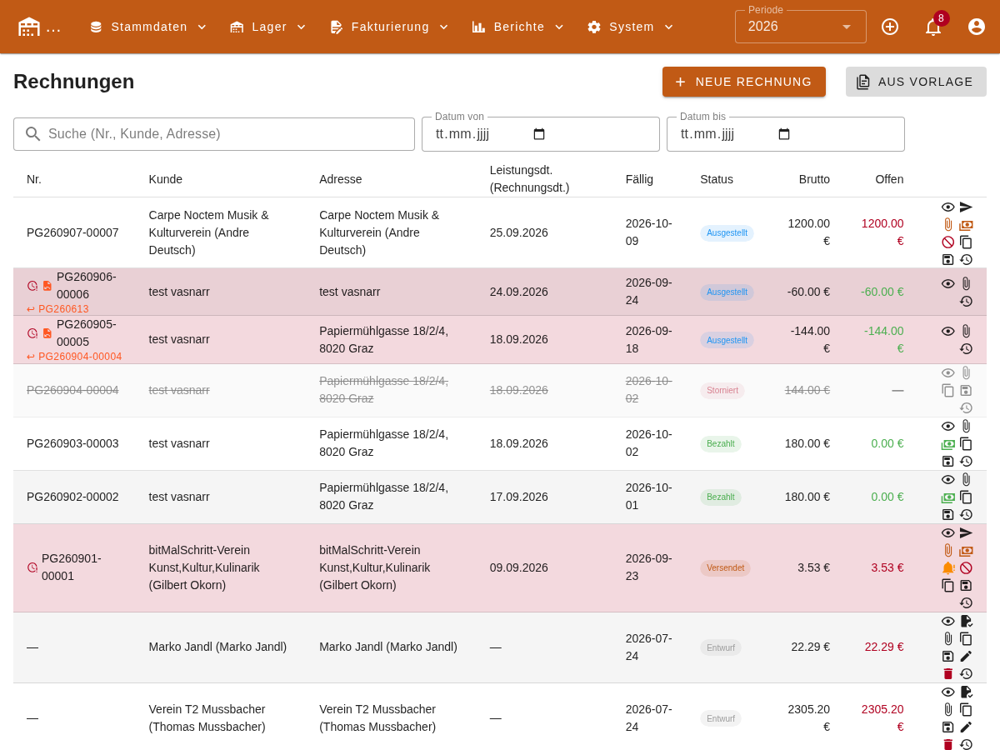

### 6.6 Rechnung stornieren (Storno)

Eine ausgestellte Rechnung kann nicht gelöscht, aber **storniert** werden:

1. **Stornieren**-Symbol (rotes Verbots-Symbol) anklicken.
2. **Stornierungsgrund** eingeben (Pflichtfeld).
3. Wählen, ob zusätzlich ein **neuer Rechnungsentwurf** aus der Originalrechnung erstellt werden soll (z. B. für eine Korrektur).
4. **Stornieren**.

Es entsteht eine **Stornorechnung**, die mit dem Bezug zur Originalrechnung (↩) verknüpft wird.

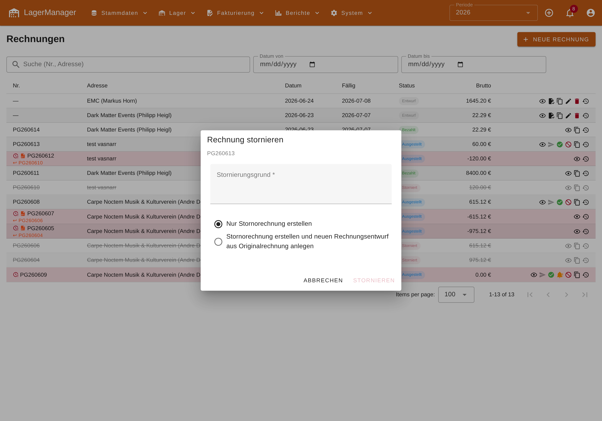

### 6.7 Weitere Aktionen

- **Senden** (Papierflieger-Symbol) – ausgestellte/versendete Rechnung per E-Mail versenden, siehe [Abschnitt 8](#8-vorschau-pdf-versand--verlauf). Bei Stornorechnungen nicht verfügbar.
- **Anhänge** (Büroklammer-Symbol) – Ergänzungen, Berichtigungsnoten und Dateien zur Rechnung verwalten, siehe [Abschnitt 8](#anhänge).
- **Duplizieren** – erstellt eine Kopie als neuen Entwurf.
- **Bearbeiten** / **Löschen** – nur für Entwürfe.
- **Vorschau** / **Verlauf** – wie bei Angeboten.
- **Als Vorlage speichern** – siehe [Abschnitt 6.8](#68-rechnungsvorlagen).

### 6.8 Rechnungsvorlagen

Wiederkehrende Rechnungen (z. B. immer gleiche Positionen für einen bestimmten Zweck) lassen sich als **Vorlage** speichern und für neue Rechnungsentwürfe wiederverwenden. Eine Vorlage enthält die **Positionen** und **Anmerkungen**, jedoch **keine Adresse** – diese wird bei jeder neuen Rechnung individuell gewählt.

**Rechnung als Vorlage speichern:**

- Im Rechnungsdialog einer bereits gespeicherten Rechnung über die Schaltfläche **Als Vorlage speichern** unten im Dialog, oder
- direkt aus der Rechnungsliste über das Speichern-Symbol in der jeweiligen Zeile (nicht bei Stornorechnungen verfügbar).

In beiden Fällen wird ein **Vorlagenname** abgefragt und die Vorlage gespeichert.

**Neue Rechnung aus Vorlage erstellen:**

1. In der Rechnungsliste oben die Schaltfläche **Aus Vorlage** anklicken.
2. Im Auswahldialog die gewünschte Vorlage anklicken (Name und Bruttosumme werden angezeigt).
3. Es öffnet sich ein neuer Rechnungsentwurf mit den Positionen und Anmerkungen der Vorlage; nur die **Adresse** muss noch ergänzt werden.

Im selben Auswahldialog können Vorlagen über die Symbole am rechten Rand **umbenannt** oder **gelöscht** werden.

---

## 7. Mahnungen erstellen

Mahnungen sind Zahlungserinnerungen zu überfälligen Rechnungen und werden in **Mahnstufen** geführt. Die Anzahl der Stufen ist über die Einstellung **Maximale Mahnstufe** konfigurierbar (Vorgabe: 3).

### 7.1 Mahnung aus einer überfälligen Rechnung erzeugen (empfohlen)

1. In der **Rechnungsliste** bei der überfälligen Rechnung das Symbol **Mahnung erstellen** (Glocken-Symbol) anklicken.
2. Es wird automatisch ein **Mahnungsentwurf** zur betreffenden Rechnung angelegt und in der Mahnungsansicht geöffnet.

> Das Glocken-Symbol **Mahnung erstellen** erscheint bei überfälligen Rechnungen am rechten Zeilenrand – siehe Rechnungsliste oben.

### 7.2 Mahnung manuell anlegen

1. **Fakturierung → Mahnungen → Neue Mahnung**.
2. Felder ausfüllen:
   - **Rechnung** (Pflichtfeld) – die zu mahnende Rechnung auswählen.
   - **Mahnstufe** (1 bis zur konfigurierten maximalen Mahnstufe).
   - **Mahnungsdatum** (Pflichtfeld, vorbelegt mit heute).
   - **Zahlungsfrist** (Pflichtfeld) – darf nicht vor dem Mahnungsdatum liegen.
   - **Mahngebühr (€)** – vorbelegt mit der Standard-Mahngebühr.
   - **Anmerkungen**.
3. **Speichern** (Status **Entwurf**).

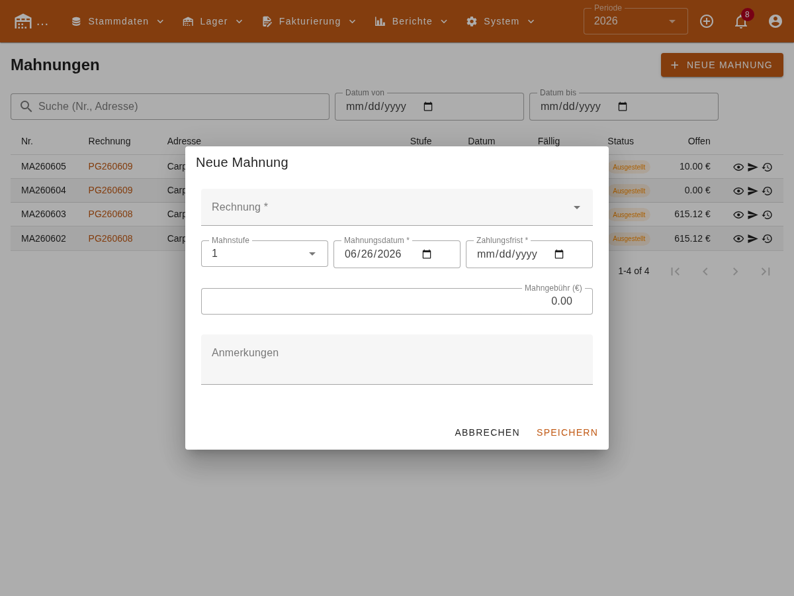

### 7.3 Mahnung ausstellen

Über das **Ausstellen**-Symbol wird die Mahnungsnummer vergeben und der Status auf **Ausgestellt** gesetzt.
Die Mahngebühr wird damit dem Kundenkonto belastet und ist danach nicht mehr änderbar.

### 7.4 Mahnungsliste

Die Liste zeigt u. a. Mahnungsnummer, verknüpfte **Rechnung** (anklickbar zur Vorschau), Adresse, **Stufe** (farblich: höchste konfigurierte Stufe rot, vorletzte Stufe orange), Datum, Fälligkeit, Status und den **offenen Betrag**.

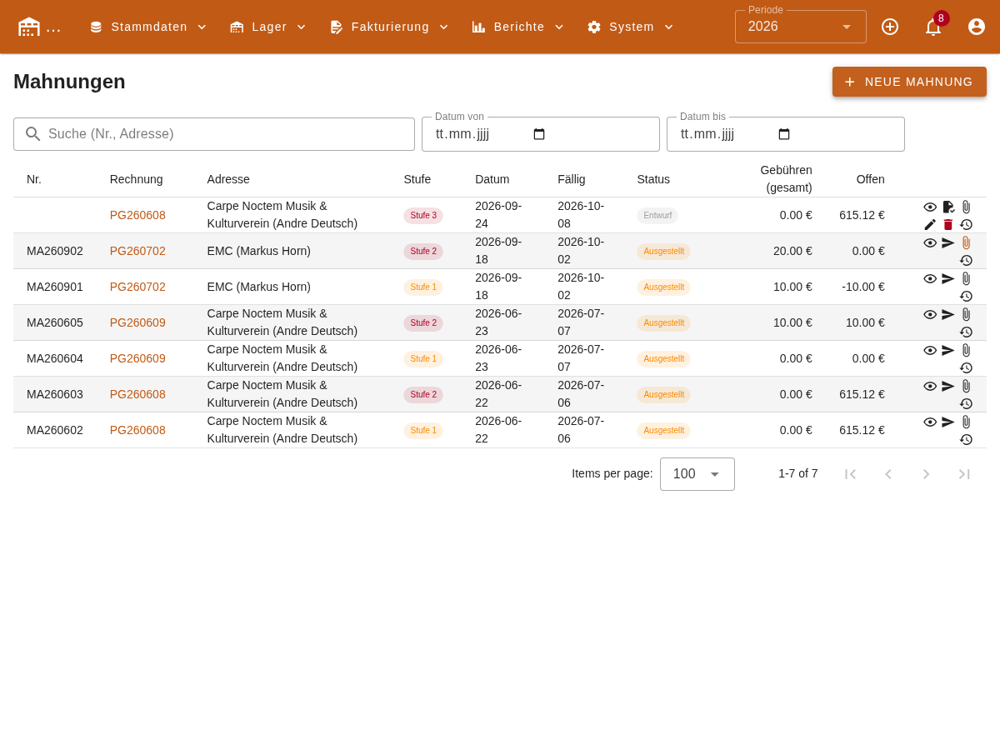

> Entwürfe können bearbeitet und gelöscht werden; ausgestellte Mahnungen nicht.

> Ist bei einer Mahnung die **höchste konfigurierte Mahnstufe** erreicht, wird auf dem Mahnungsdokument statt der Stufennummer der Text **„Letzte Mahnung"** angezeigt.

Ausgestellte Mahnungen können über das **Senden**-Symbol (Papierflieger) per E-Mail an den Empfänger verschickt werden – siehe [Abschnitt 8](#8-vorschau-pdf-versand--verlauf). Über das **Büroklammer-Symbol** lassen sich [Anhänge](#anhänge) verwalten.

---

## 8. Vorschau, PDF, Versand & Verlauf

> Schlägt eine Aktion in den Dialogen für Angebote, Rechnungen oder Mahnungen fehl (z. B. beim Speichern oder Laden), erscheint unten am Bildschirmrand eine Fehlermeldung mit dem Grund, statt dass die Aktion ohne Rückmeldung erfolglos bleibt.

### Vorschau / PDF

Über das **Augen-Symbol** (oder Klick auf eine ausgestellte Zeile) öffnet sich die **Dokumentvorschau**: das Dokument als PDF, so wie es verschickt wird. [Berichtigungsnoten](#berichtigungsnoten) sind darin **immer als zusätzliche Seiten enthalten**, da sie untrennbar zum Dokument gehören. Ergänzungen und Dateien sind dagegen nicht enthalten – sie werden erst beim [E-Mail-Versand](#e-mail-versand) ausgewählt. Oben rechts steht **Herunterladen** zur Verfügung, um genau dieses PDF zu speichern und anschließend zu drucken oder zu versenden. Auch ein ausgedrucktes oder anderweitig verschicktes Dokument enthält so stets seine Berichtigungen.

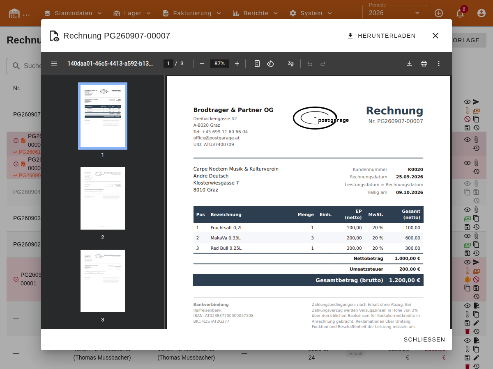

> Vorhandene **Anmerkungen** werden auf dem Dokument oberhalb der Positionstabelle angezeigt (ohne eigene Überschrift). Geldbeträge werden mit Tausenderpunkt dargestellt, z. B. `1.234,56 €`.

### Anhänge

Zu jedem Angebot, jeder Rechnung und jeder Mahnung können **Anhänge** hinterlegt werden. Das **Büroklammer-Symbol** in der jeweiligen Liste öffnet den Dialog **Anhänge**. Hat ein Dokument bereits Anhänge, ist die Büroklammer farbig hervorgehoben; beim Überfahren mit der Maus wird ihre Anzahl angezeigt. Es gibt drei Arten:

- **Ergänzung** – ein frei erfassbarer Text (Titel und Inhalt), der im Layout des Dokuments gesetzt wird, also mit Logo, Absender, Empfänger und Dokumentnummer. Je Dokument sind beliebig viele Ergänzungen möglich.
- **Berichtigungsnote** – eine verbindliche Korrektur eines ausgestellten Dokuments, siehe [unten](#berichtigungsnoten).
- **Datei** – eine hochgeladene Datei mit einer kurzen Beschreibung (z. B. ein eingescannter Lieferschein).

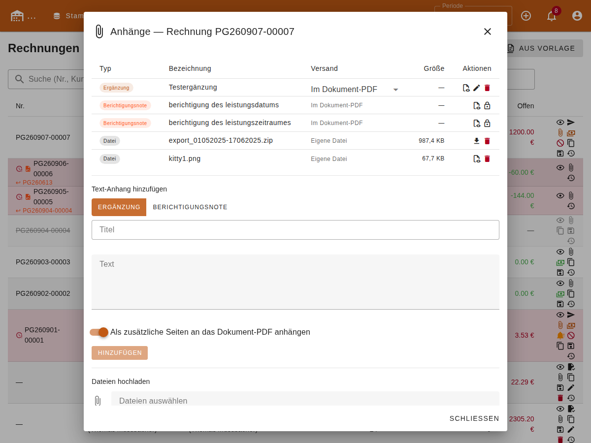

Die Tabelle im oberen Teil des Dialogs listet alle Anhänge des Dokuments:

| Spalte | Inhalt |
|--------|--------|
| **Typ** | Ergänzung, Berichtigungsnote oder Datei |
| **Bezeichnung** | Titel bzw. Beschreibung; bei Dateien mit Beschreibung steht darunter der Dateiname, ohne Beschreibung wird der Dateiname selbst angezeigt |
| **Versand** | **Im Dokument-PDF** (als zusätzliche Seiten) oder **Eigene Datei**. Nur bei Ergänzungen über ein Auswahlfeld änderbar – bei Berichtigungsnoten und Dateien ist die Versandart fest vorgegeben. |
| **Größe** | Dateigröße (nur bei Dateien) |
| **Aktionen** | **Vorschau** bzw. **Download**, **Bearbeiten** (Stift, nur bei Ergänzungen) und **Löschen** (Papierkorb). Ein **Schloss-Symbol** kennzeichnet einen Anhang, der nicht gelöscht werden kann. |

**Ergänzung anlegen:** Unter **Text-Anhang hinzufügen** die Art **Ergänzung** wählen, Titel und Text erfassen und auf **Hinzufügen** klicken. Der Schalter **„Als zusätzliche Seiten an das Dokument-PDF anhängen"** steuert, wie die Ergänzung beim Versand mitgeschickt wird:

- **eingeschaltet** (Vorgabe): Die Ergänzung wird als zusätzliche Seite(n) an das Dokument-PDF angehängt – der Empfänger erhält **eine** Datei.
- **ausgeschaltet**: Die Ergänzung wird als **eigenes PDF** neben dem Dokument verschickt.

**Ergänzung bearbeiten oder löschen:** Das **Stift-Symbol** lädt die Ergänzung in das Formular (**Ergänzung bearbeiten**); Änderungen werden mit **Speichern** übernommen oder mit **Abbrechen** verworfen. Die Versandart lässt sich außerdem jederzeit direkt in der Spalte **Versand** ändern. Das **Papierkorb-Symbol** löscht einen Anhang nach einer Sicherheitsabfrage.

**Dateien hochladen:** Über **Dateien auswählen** eine oder mehrere Dateien auswählen, je Datei eine Beschreibung erfassen und auf **Hochladen** klicken. Pro Datei sind höchstens **25 MB** möglich. Dateien werden **immer als eigener Anhang** mitgeschickt und nie in das Dokument-PDF eingefügt. Die Beschreibung lässt sich nachträglich nicht mehr ändern – dazu die Datei löschen und erneut hochladen.

**Vorschau:** Das **Vorschau-Symbol** zeigt den Anhang so, wie ihn der Empfänger erhält:

- Ist ein Anhang **in das Dokument-PDF eingebettet** – Ergänzungen mit dieser Versandart und Berichtigungsnoten immer –, zeigt die Vorschau das **gesamte Dokument mit allen eingebetteten Anhängen**, gleich bei welchem Anhang das Symbol angeklickt wurde. Genau diese eine Datei erhält der Empfänger.
- Wird ein Anhang als **eigene Datei** verschickt, zeigt die Vorschau nur diese Datei.
- Hochgeladene **PDFs und Bilder** werden ebenfalls direkt angezeigt. Dateien, die der Browser nicht darstellen kann (z. B. Tabellen-, Word- oder ZIP-Dateien), erscheinen stattdessen mit einem **Download-Symbol**.

Aus der Vorschau heraus kann die angezeigte Datei jederzeit über **Herunterladen** gespeichert werden.

> Ergänzungen und Dateien können in **jedem Status** hinzugefügt, geändert und gelöscht werden – auch bei bereits ausgestellten, versendeten oder bezahlten Dokumenten. Sie sind Zusatzinformation rund um das Dokument, das Dokument selbst bleibt unverändert. Was tatsächlich verschickt wurde, bleibt im [Versand-Verlauf](#e-mail-versand) nachvollziehbar. Für Berichtigungsnoten gelten strengere Regeln (siehe unten).

> **Unbekannter Anhangstyp:** Steht in der Spalte **Typ** eine unbekannte Bezeichnung (etwa nach einem Fehler bei einem Update), ist der Anhang aus Sicherheitsgründen gesperrt: Er kann nicht gelöscht werden. In diesem Fall bitte den Administrator informieren.

#### Berichtigungsnoten

Eine **Berichtigungsnote** korrigiert ein bereits ausgestelltes Dokument, ohne das Dokument selbst zu verändern – etwa einen falsch angegebenen Leistungszeitraum. Sie wird wie eine Ergänzung erfasst (Titel und Text) und im Layout des Dokuments gesetzt. Auf der Seite stehen außerdem die **laufende Nummer** der Berichtigung sowie **Nummer und Datum des berichtigten Dokuments**.

**Berichtigungsnote anlegen:**

1. Das Dokument muss **ausgestellt** sein. Bei einem Entwurf ist die Schaltfläche **Berichtigungsnote** deaktiviert – ein Entwurf wird einfach direkt bearbeitet.
2. Im Dialog **Anhänge** unter **Text-Anhang hinzufügen** die Art **Berichtigungsnote** wählen. Ein Hinweis erinnert daran, dass sie danach weder geändert noch gelöscht werden kann.
3. **Titel** und **Text** der Berichtigung erfassen. Die Versandart ist fest vorgegeben („Im Dokument-PDF").
4. Auf **Hinzufügen** klicken und die Sicherheitsabfrage bestätigen.

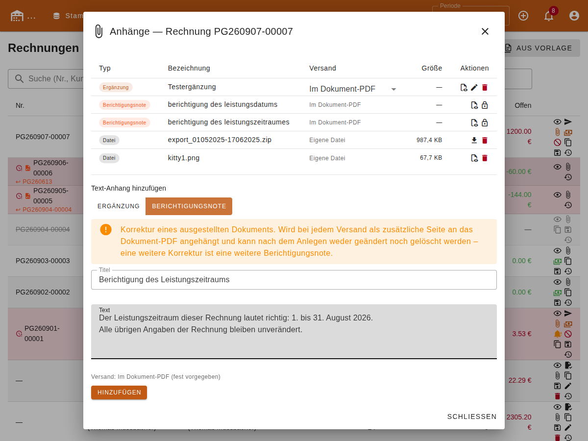

Für Berichtigungsnoten gelten feste Regeln:

- Sie können nur zu **ausgestellten** Dokumenten angelegt werden.
- Sie werden bei **jedem E-Mail-Versand des Dokuments automatisch mitgeschickt** und können im Versand-Dialog nicht abgewählt werden (Kennzeichnung **Pflicht**).
- Sie werden **immer als zusätzliche Seite(n) an das Dokument-PDF angehängt** – nie als eigene Datei. Der Empfänger erhält die Berichtigung also stets zusammen mit dem berichtigten Dokument in einer Datei. Eine Auswahl der Versandart gibt es bei Berichtigungsnoten nicht.
- Sie sind auch in der [Dokumentvorschau](#vorschau--pdf) und im dort heruntergeladenen PDF immer enthalten – ein ausgedrucktes oder anderweitig weitergegebenes Dokument trägt seine Berichtigungen also ebenfalls.
- Sie können nach dem Anlegen **weder geändert noch gelöscht** werden. In der Liste erscheint statt des Papierkorbs ein Schloss-Symbol.
- Ist eine Berichtigung selbst falsch, wird eine **weitere Berichtigungsnote** angelegt. Pro Dokument sind beliebig viele möglich; sie werden fortlaufend nummeriert.

So erscheint eine Berichtigungsnote in der Dokumentvorschau – hier als zweite Seite der Rechnung:

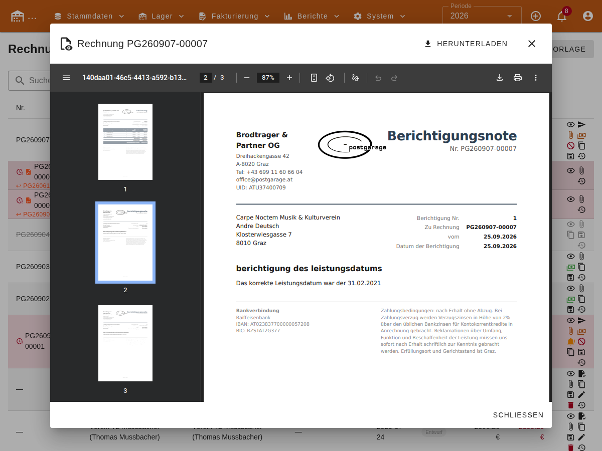

### E-Mail-Versand

Ausgestellte (und bereits versendete) Angebote, Rechnungen und Mahnungen können direkt aus der Anwendung per E-Mail an den Empfänger geschickt werden. Das Dokument wird dabei automatisch als **PDF-Anhang** beigefügt – es muss nichts manuell hochgeladen werden.

1. In der jeweiligen Liste (**Angebote**, **Rechnungen** oder **Mahnungen**) in der Zeile das **Senden**-Symbol (Papierflieger) anklicken.
2. Der Dialog **Dokument versenden** öffnet sich. Vorbelegt sind:
   - **An** – die E-Mail-Adresse aus der hinterlegten Adresse (kann überschrieben oder ergänzt werden; Pflichtfeld).
   - **Betreff** und **Nachricht** – aus den in den [Einstellungen](#1-überblick--voraussetzungen) hinterlegten Vorlagen, wobei Platzhalter wie `{number}` und `{company}` automatisch durch die tatsächlichen Werte ersetzt sind.
   - **Anhänge mitsenden** – sind zum Dokument [Anhänge](#anhänge) hinterlegt, werden sie hier zum Ankreuzen aufgelistet. Welche Arten vorausgewählt sind, bestimmt die Einstellung **Anhangstypen, die im Versand-Dialog vorausgewählt sind**. Bei jedem Anhang steht, ob er an das Dokument-PDF angehängt oder als eigene Datei verschickt wird. [Berichtigungsnoten](#berichtigungsnoten) sind mit **Pflicht** gekennzeichnet, immer angekreuzt und nicht abwählbar.
3. **Vorher ansehen:** Das **Vorschau-Symbol** neben „Das Dokument wird als PDF-Anhang beigefügt" zeigt das Dokument **genau so, wie es verschickt wird** – also inklusive aller angekreuzten Ergänzungen und Berichtigungsnoten, die als zusätzliche Seiten mitgehen. Dieselbe Zeile nennt auch, wie viele Anhänge als Seiten eingefügt und wie viele zusätzliche Dateien angehängt werden. Jeder einzelne Anhang hat ebenfalls ein Vorschau-Symbol (bzw. ein Download-Symbol, wenn der Browser die Datei nicht anzeigen kann).
4. Text bei Bedarf anpassen, Anhänge auswählen und auf **Senden** klicken.

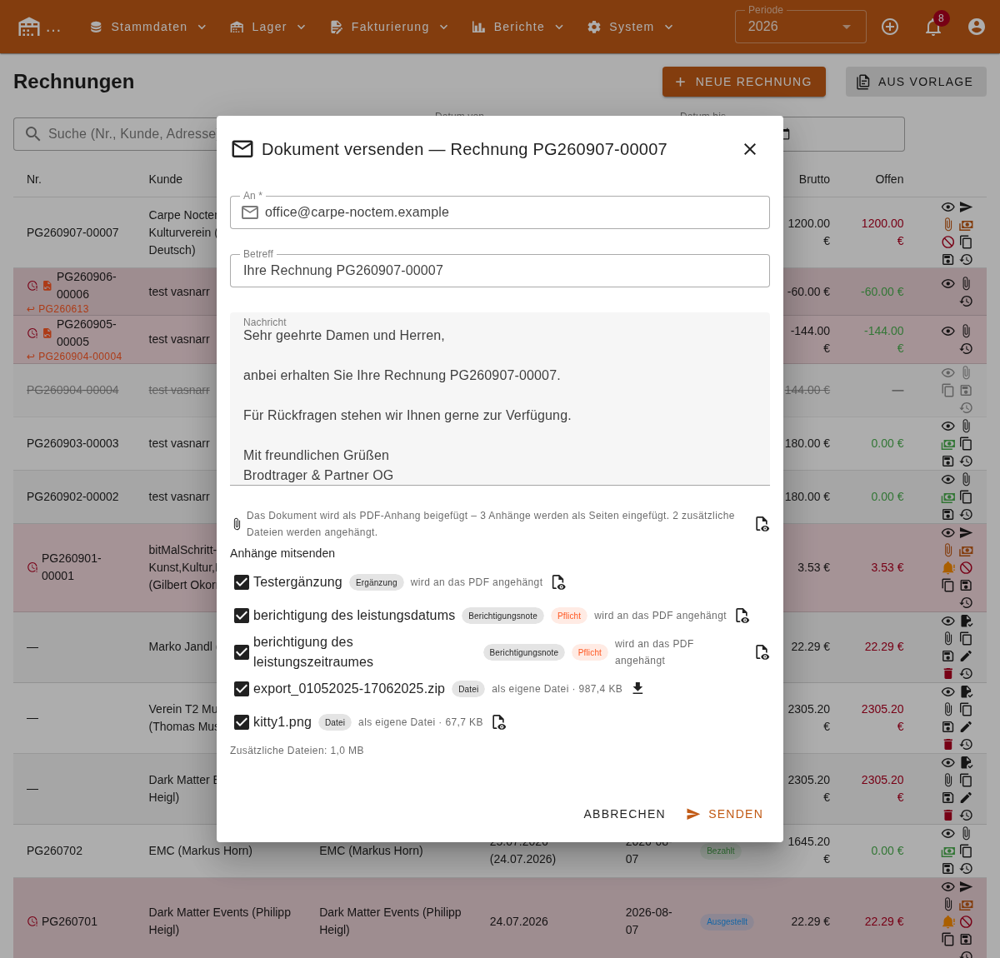

**Hinweise:**

- Bei **Angeboten** und **Rechnungen** wechselt der Status nach erfolgreichem Versand automatisch auf **Versendet**. **Mahnungen** besitzen keinen eigenen Versendet-Status und bleiben **Ausgestellt** (sie können bei Bedarf erneut versendet werden).
- Jeder Sendeversuch wird protokolliert: Der **Versand-Verlauf** im unteren Teil des Dialogs listet Zeitpunkt, Benutzer, Empfänger, Status (**Versendet** / **Fehler**) sowie **alle** mitgesendeten Anhänge (anklickbar) auf – also auch Ergänzungen und Dateien, genau so, wie sie beim Empfänger angekommen sind.
- Schlägt der Versand fehl (z. B. ungültige Empfängeradresse oder ein SMTP-Problem), erscheint eine Fehlermeldung; auch der Fehlversuch wird im Verlauf festgehalten.
- Unter der Anhangsliste steht die Gesamtgröße der zusätzlichen Dateien. Übersteigt sie **10 MB**, erscheint ein Warnhinweis – manche Mailserver weisen so große E-Mails ab.
- **Stornorechnungen** können nicht versendet werden – für sie wird kein Senden-Symbol angezeigt.

### Verlauf

Das **Uhr-Symbol** (Verlauf) zeigt zu jedem Dokument und jeder Adresse die Änderungshistorie (wer hat wann was geändert).

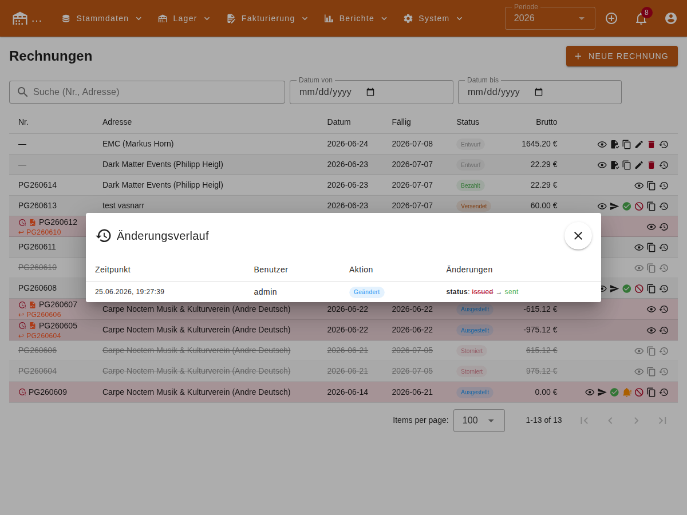

---

## 9. Statusübersicht

### Angebote

| Status | Bedeutung |
|--------|-----------|
| **Entwurf** | Bearbeitbar, noch keine Nummer |
| **Ausgestellt** | Nummer vergeben, festgeschrieben |
| **Versendet** | An Kunden geschickt |
| **Angenommen** | Vom Kunden angenommen |
| **Abgelehnt** | Vom Kunden abgelehnt |
| **Umgewandelt** | In eine Rechnung umgewandelt |

### Rechnungen

| Status | Bedeutung |
|--------|-----------|
| **Entwurf** | Bearbeitbar, noch keine Nummer |
| **Ausgestellt** | Nummer vergeben, festgeschrieben |
| **Versendet** | An Kunden geschickt |
| **Teilweise bezahlt** | Zahlungen erfasst, aber noch ein Restbetrag offen |
| **Bezahlt** | Vollständig bezahlt (inkl. Mahngebühren) |
| **Storniert** | Durch Stornorechnung aufgehoben |

### Mahnungen

| Status | Bedeutung |
|--------|-----------|
| **Entwurf** | Bearbeitbar, noch keine Nummer |
| **Ausgestellt** | Nummer vergeben |
| **Bezahlt** | Zugrunde liegende Rechnung beglichen |

---

## Anhang: Änderungsprotokoll

Kurze Übersicht der Änderungen an der Fakturierung seit der letzten größeren Überarbeitung dieses Handbuchs, neueste zuerst:

| Datum | Änderung |
|-------|----------|
| September 2026 | Neu: **Berichtigungsnoten** – verbindliche Korrekturen ausgestellter Angebote, Rechnungen und Mahnungen. Sie werden bei jedem Versand automatisch als zusätzliche Seite an das Dokument-PDF angehängt, sind fortlaufend nummeriert und können weder geändert noch gelöscht werden. Auch die Dokumentvorschau und das heruntergeladene PDF enthalten sie. |
| September 2026 | Neu: **Anhänge** zu Angeboten, Rechnungen und Mahnungen – frei erfassbare **Ergänzungen** (wahlweise als zusätzliche Seiten im Dokument-PDF oder als eigenes PDF) und hochgeladene **Dateien**. Beim E-Mail-Versand ist auswählbar, welche Anhänge mitgehen; eine **Vorschau** zeigt das Dokument genau so, wie es beim Empfänger ankommt. |
| September 2026 | Neu: **Kunden** (Menü Stammdaten) mit mehreren Adressen, Kundennummer und **Saldo**; das Kundenkonto zeigt alle Bewegungen und nimmt Anzahlungen entgegen. |
| September 2026 | Neu: **Teilzahlungen** – mehrere Zahlungen je Rechnung, neuer Status **Teilweise bezahlt**, neue Spalte **Offen**. Ein **Guthaben** wird beim Ausstellen automatisch verrechnet. |
| September 2026 | Rechnungen und Mahnungen weisen die einzelnen Zahlungen und den **offenen Betrag** aus. Mahngebühren sind nach dem Ausstellen fix, Mahnungen nur für offene Rechnungen möglich. |
| Juli 2026 | Neues Feld **Leistungsdatum** bei Rechnungen; **Rechnungsdatum** und **Fälligkeitsdatum** werden nicht mehr im Entwurf erfasst, sondern automatisch beim Ausstellen gesetzt. |
| Juli 2026 | Geldbeträge auf Angeboten, Rechnungen und Mahnungen werden jetzt mit Tausenderpunkt dargestellt (z. B. `1.234,56 €`). |
| Juli 2026 | Anmerkungen erscheinen auf dem Dokument jetzt oberhalb der Positionen, ohne eigene Überschrift „Anmerkungen". |
| Juli 2026 | Neu: **Rechnungsvorlagen** – Positionen und Anmerkungen einer Rechnung als Vorlage speichern und für neue Rechnungen wiederverwenden. |
| Juli 2026 | Positionen in Angeboten und Rechnungen können jetzt per Drag-and-Drop oder über Pfeiltasten neu angeordnet werden. |
| Juli 2026 | Zahlenfelder (z. B. Menge, Preis) unterstützen jetzt einfache Rechenformeln, z. B. `=12*3,5`. |
| Juli 2026 | Fehler beim Speichern oder Laden von Angeboten, Rechnungen und Mahnungen werden jetzt als Meldung angezeigt, statt kommentarlos zu scheitern. |
| Juni 2026 | Die maximale Mahnstufe ist jetzt über die Einstellungen konfigurierbar; bei Erreichen erscheint auf der Mahnung „Letzte Mahnung" statt der Stufennummer. |
| Juni 2026 | Die Mahngebühr wird beim Anlegen einer neuen Mahnung automatisch aus den Einstellungen vorbefüllt. |

---

*Stand: September 2026*
